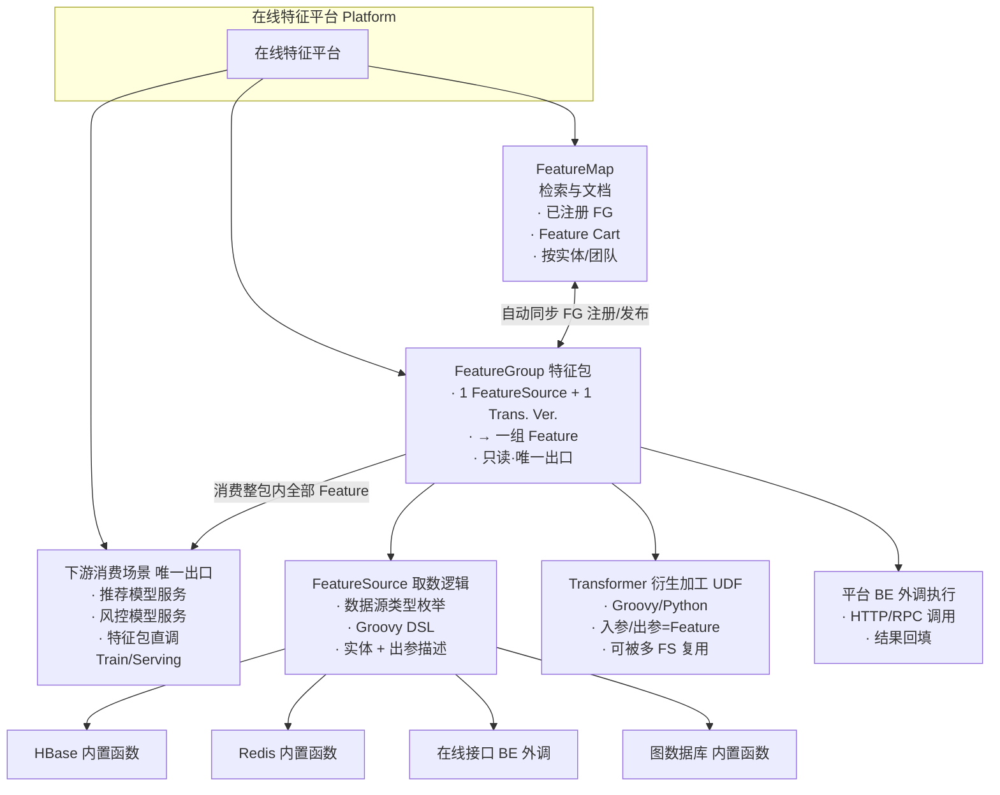
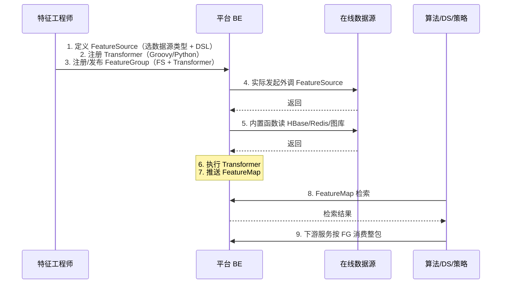

# 在线特征平台架构说明

## 1. 文档目的与范围

- **目的**：定义在线特征平台各层级的概念、边界与协作关系，为算法/特征工程师开发特征包、以及算法/DS/策略检索可用线上/离线特征提供统一理解。
- **范围**：平台侧包含 FeatureSource、Transformer、FeatureGroup、FeatureMap 四层，以及特征消费层的离线宽表与在线工作流；离在线一致性由 **FeatureGroup 层** 实现。数据准备（如 Spark/Flink 写 HBase）与下游消费场景的耗时与监控不在此文档定义。

**设计边界（重要）**

- **FeatureGroup 只读**：FG 由注册产生，平台不对 FG 进行写入；数据写入由上游数据管道完成。
- **数据质量校验**：归属上游；平台不承担写入前/写入时的数据校验。
- **数据分布探查与监控**：归属平台**二期** Scope；在对应层级结构中提及并列出，不做详细设计与展开。

---

## 2. 总体架构图

- **draw.io 图**：见 **`docs/architecture/在线特征平台-架构图.drawio`**（与本架构说明同目录），可用 [draw.io](https://app.diagrams.net/) 或 VS Code 的 Draw.io Integration 打开编辑；与下文文字说明及第 6 节概念关系一致。



---

## 3. 离在线语义与一致性（FG 层保障）

### 3.1 在线与离线语义

| 场景 | 配置与存储 | 语义 |
|------|------------|------|
| **在线** | 使用 **FG Online Config**；从 HBase/Redis/图库/在线接口等取数。 | 仅提供**特征最新值**，用于 **Serving 场景**：Model Serving、AI Workflow/Agent 等。 |
| **离线** | 使用 **FG Offline Config**；离线特征存于 Hive，全量历史。 | **历史回溯**仅通过离线宽表/离线存储；用于 **Training 场景**：生成特征训练大宽表 → Model Training、Strategy Backfill 等。 |

**在线 Feature 三类来源**（均通过 FG 层映射到与离线 Feature Column 一致，保障离在线一致性）：(1) **离线导入在线**：Hive 入湖 → HBase/Redis FeatureSource → getHBase 等 Transformer → 与离线 Feature Column 对应的在线 Feature；(2) **Nearline 准实时**：Kafka → Flink → HBase FeatureSource → ScanHBase 等 Transformer → 与离线 ODS 日志加工所得原始离线 Feature Column 对应的在线 Feature；(3) **在线计算**：HTTP/RPC FeatureSource 取 raw Feature → Transformer 计算 → 与离线外调结果 ODS 加工所得原始离线 Feature Column 对应的在线 Feature。

离在线一致性由 **FG 层** 保障：同一 FG 下，**Offline FG Config** 与 **Online FG Config** 在 **Feature 粒度** 做映射，并通过 **Training Availability（离线可用性）** 与 **Serving Availability（在线可用性）** 在平台内显式展示每个 Feature 的离/在线可用性。

### 3.2 训练与 Serving 一致性（避免 Training/Serving Skew）

训练与 Serving 使用**同一 Transformer Version** 逻辑：FG 绑定某一版本的 Transformer，离线宽表与在线服务均基于该版本产出特征，由 FG 层保障，避免 training/serving skew。

### 3.3 Feature Group 的 Train-Serve 双模式

Feature Group 需同时支持 **Train** 与 **Serve** 两种模式，与 3.1 在线/离线语义、3.2 同一 Transformer Version 以及 4.5 的 Offline/Online FG Config 对应一致。

| 模式 | 场景 | 数据来源与职责 |
|------|------|----------------|
| **Train Feature Group（Offline）** | 离线/训练 | 管理并记录常用于生成研发宽表的**离线物理表**（Hive Table + PK + marker、Date Partition 等，见 Offline FG Config）。 |
| **Serve Feature Group（Online）** | 在线/服务 | 由 **Feature Source + Transformation** 的组合逻辑生产：Feature Source 从 HBase/Redis/图库/在线接口取数，经 Transformer 产出 Fine Feature，对应在线特征存储。 |

---

## 4. 层级定义与边界

### 4.1 FeatureSource 层

| 项目 | 说明 |
|------|------|
| **职责** | 定义「从底层真实数据源取数」的逻辑，是特征包所描述实体与出参特征的**服务出口描述**，供下游按契约消费。 |
| **边界** | 只负责「取数」：选择数据源类型、配置扫描/查询参数、调用平台内置函数或触发 BE 外调，输出原始或半结构化数据供 Transformer 消费。不包含 Spark/Flink 等前置加工，该部分由上游其他平台准备好并写入在线数据源。 |

**数据源类型（枚举）**

- `HBase`：通过平台内置 Groovy 函数（如 Scan、reverse 等）访问。
- `Redis`：通过平台内置函数访问。
- `在线接口`：HTTP/RPC 等外调由**平台 BE 负责执行**，FeatureSource 脚本中通过「外调函数」声明入参与结果映射。
- `图数据库`：通过平台内置函数访问。

**脚本形式**

- 基于**内置 Groovy 函数模板的 DSL**，在定义 FeatureSource 时选择数据源类型并填写模板参数/脚本片段。产品侧 FS 创建分为**元信息**与 **Region 配置**两步（见产品原型 §3.1.2）。

**必须清晰表达的内容（作为下游契约）**

- **实体**：本特征包所描述的实体（来自预定义实体枚举，可多实体关联）。
- **出参特征**：本 FeatureSource 产出并交给 Transformer 的字段/结构描述，便于下游理解「特征包内有哪些特征、含义与形状」。

**入参**

- 由具体数据源类型与业务决定（如实体 ID 列表、时间范围等），不做全局固化；但需在 FeatureSource 定义处可读、可文档化。

---

### 4.2 Transformer 层

| 项目 | 说明 |
|------|------|
| **职责** | 对 FeatureSource 取到的数据进行**衍生加工**，输出即为 Feature；语言为 Groovy 或 Python。 |
| **边界** | 仅做「输入 → 输出」的转换，不直接访问 HBase/Redis 等存储；若需复杂多源或嵌套逻辑，由算法/特征工程师拆成多个 Transformer 分别注册、在各自 FeatureGroup 中组合使用，平台不显式维护 DAG。 |

**复用关系**

- 一个 **Transformer 可被多个 FeatureSource（即多个 FeatureGroup）关联使用**。
- 嵌套/组合通过「单独注册、多处引用」完成，不设显式 DAG。

**入参 / 出参**

- **入参**：上游 FeatureSource 的输出（或平台约定的统一结构）。
- **出参**：**多个 Feature**，每个 Feature 具备：
  - 名称与含义（与 FeatureGroup 出参描述一致）；
  - **DataType**（Feature 粒度，具体枚举范围 MVP 不强制收口）。

**Entity**

- Entity 为 **FeatureGroup 粒度**，在 FG 注册时由所选的 FeatureSource 的实体定义继承而来，不在 Transformer 上单独定义。

**4.2.1 映射签名（Transformation 基本类型）**

Transformation 提供两种基本映射签名，用于统一离/近/在线算子的输入输出形态：离线/近线时将逻辑按 `column:value` 封装为 Map 或 List&lt;Map&gt; 作为算子输入，将返回的 Map 的 key 打平成表的 column。

| 类型 | 签名 | 语义 | 典型场景 |
|------|------|------|----------|
| **ScalarFunction** | Map → Map | 单行数据到单行数据 | 外数解析：离线/近线时按 column:value 封装成单行 Map 作为算子 input，返参 Map 的 key 打平成表 column。 |
| **AggregateFunction** | List&lt;Map&gt; → Map | 多行数据到单行数据 | 用户 quota 解析：离线/近线时多行按 column:value 封装成 List&lt;Map&gt; 作为算子 input，返参 Map 的 key 打平成表 column。 |

---

### 4.3 FeatureGroup 层

| 项目 | 说明 |
|------|------|
| **职责** | 将「一个 FeatureSource + 一个 Transformer」组装为**一个特征包**，产出该 Transformer 的**全部 Feature**，作为**对外服务唯一出口**。 |
| **边界** | 一个 FG 仅包含 1 个 FeatureSource + 1 个 Transformer；不会将同一 Transformer 的产出拆成多个 FG 注册。**FG 由注册产生，只读不可写**；数据写入由上游数据管道完成。 |

**概念区分（离在线一致性基础）**

- **FeatureSource 产出**：与数据源一致的 **Raw Feature**（未加工）。
- **FeatureGroup 产出**：经某一版本 Transformer 处理后的 **Fine Feature**；FG 通过 Offline/Online Config 在 Feature 粒度映射，并显式展示 **Training Availability（离线可用性）** 与 **Serving Availability（在线可用性）**。
- **Train-Serve 双模式**：FG 同时支持 **Train 模式**（离线物理表管理，见 3.3）与 **Serve 模式**（Feature Source + Transformation 生产）；二者在配置上对应 Offline FG Config 与 Online FG Config。

**入参与出参**

- **入参**：1 个 FeatureSource + 1 个 Transformer（**绑定某一 Transformer Version**）。
- **出参**：该 Transformer 产出的**全部 Feature**（实体在 FG 粒度描述，DataType 在 Feature 粒度）。**实体与 Team 仅在 FG 层级定义与暴露**；FeatureSource 不单独定义实体，由 FG 继承。

**生命周期与发布**

- **状态**：`Online` → 发布时进入 `Online Changing` → Admin 确认后更新为最新线上配置（仍为 `Online`）。
- **版本**：**FG 无 Version 概念，更新即 Force Release**。Transformer 有版本管理，FG 绑定某一 Transformer Version。

**权限与可见性**

- FG 有 **user** 与 **biz_team** 管理。
- 默认 **all team** 可见、可用。
- 敏感数据可改为**指定 biz_team**：仅该团队可用；其他团队用户仅在 **FeatureMap 可见、不可用**。

---

### 4.4 FeatureMap 层

| 项目 | 说明 |
|------|------|
| **职责** | 对**已注册的 FeatureGroup** 做集中检索与文档展示，供算法/DS/策略查找「有哪些可用的线上/离线特征」；支持** Feature 粒度**勾选与** Feature Cart** 能力。 |
| **边界** | 仅做检索与文档，**不**作为下游模型或服务的特征拉取接口；下游的**唯一出口是 FeatureGroup**（按特征包维度消费包内全部特征）。 |

**数据来源与更新**

- 由 **FeatureGroup 注册/发布** 驱动：FG 注册或发布时**推送**更新到 FeatureMap（Auto Sync & Indexing），保证与当前线上可用的 FG 一致。

**能力**

- 按实体、biz_team、可见性等检索；
- 展示 FG 及其包含的 Feature、实体、DataType、权限与可见性（含「仅可见不可用」的说明）；
- **Feature Cart**：用户可勾选 Feature 级特征资产，左下角购物车图标展示已选 Feature 数量；点击购物车可将所选 Feature **快速注册到消费场景**，如「特征离线宽表画布」「特征在线服务 Workflow 画布」等。

---

### 4.5 Feature Group 与配置层

以下为平台提供的配置与元信息能力，用于与 FE 对接接口定义，支撑用户在前端 Web 页面的操作。**数据分布探查与监控**为平台二期 Scope，在此仅列出、不展开详细设计。

| 类别 | 内容 |
|------|------|
| **Metainfo** | Region + Entity；Owner + Multi-Project；Freshness + Desc。 |
| **Offline FG Config** | Hive Table + PK + marker；Date Partition Column；Region Filter 等。 |
| **Online FG Config** | 绑定 1 个 FeatureSource；绑定某一 Transformer Version；将输出映射到离线 Feature（Map Outputs to Offline Fts）。 |
| **FeatureList** | Name + Datamap Info（DataType、Partition）；**Training Availability**；**Serving Availability**；Serving Script；Add Online Computing Features。 |
| **运维与追溯** | Asset Lineage；Change Logs；Serving Test Run + Test History。 |
| **二期** | 数据分布探查与监控（列出在对应层级，不做详细设计与展开）。 |

---

## 5. 离线宽表与 Point-in-Time Join

### 5.1 多 FG、不同更新节奏下的 Join

若参与宽表的多个 FG 更新节奏不同（如有的日更、有的小时更），**必须做 point-in-time correct join**，即平台提供的 **Smart Join**：在某一实体、某一事件时间点上，仅使用「不晚于该时间」的特征值，避免未来信息泄露。

- **event_time**：在**特征宽表生成画布**中由用户指定，用于控制 join 的时间语义。
- **Key Table（Spine / Spine Group）**：即 join 的「左表」，定义「为哪些实体、在哪些时间点」取特征（可含 label）。由**离线特征宽表画布的用户提供**，是一张 **External Feature Table（Hive）**；系统以**只读 FG** 形式参与 join/训练，不写入该表。

### 5.2 离线宽表流程（画布）

FG Selection（来自 Feature Cart/画布所选）→ Offline FG Config → **Key Table（Spine）** → **Smart Join（point-in-time correct）** → Data Sink。**Data Sink** 上可配置 Join 后的可选**数据清洗**（如 Fillna、Value Mapping / Case When），再落 Hive；未开启清洗时写入 **Raw** 宽表，开启后按平台规则写入 **Cleaned** 目标表（详见产品原型图 Data Sink）。

**产品侧入口**：WideTable 列表页采用**嵌套二级 Table**——外层管理 TS 元信息（Edit / Add Instance / Delete），内层展示各 Instance Version 的执行详情（Edit / Trigger / Report + More<Kill, Copy, Task Link>）。用户通过 Modal 弹窗完成 Add TS / Edit TS / Add Instance / Copy Instance（含多选 Owner、Biz Team 映射、InstanceVersion 自动递增），OK 后跳转 **Dify 式拖拽节点画布页**。画布包含三种节点类型：**Frame Table**（唯一，Hive 表源 + Fetch 字段列表 + PK/EventTime/Columns 配置）、**Feature Group**（至少一个，AutoComplete 选择 FG + Training Config 预览 + Smart Join 条件配置）、**Data Sink**（唯一，Raw/Cleaned 表名只读、可选 Data Cleaning、Task Priority + Report Template、Last Instance 摘要 Tab）。节点点击后右侧 Drawer 面板展示配置表单。顶栏操作按钮 Save / Check / Submit 控制 Instance 状态流转（DRAFT → READY）。Instance 状态机：DRAFT → READY → RUNNING → SUCCESS / FAILED / KILLED。

---

## 6. 概念关系小结

- **FG 入参**：1 FeatureSource + 1 Transformer Version。
- **FG 输出**：注册得到的特征包（一组 Fine Feature）**自动同步到 FeatureMap**；下游消费以 FG 为唯一出口。
- **FG 双模式**：FG 支持 **Train 模式**（离线物理表管理）与 **Serve 模式**（Feature Source + Transformation 生产）。
- **Transformer 映射签名**：支持 **ScalarFunction**（Map → Map）与 **AggregateFunction**（List&lt;Map&gt; → Map）两种基本类型。
- **Feature Cart**：在 FeatureMap 上选 Feature，通过购物车**衔接下游消费场景**（离线宽表画布、在线 Workflow 画布）。

```
┌─────────────────────┐  ┌─────────────────────┐
│  FeatureSource      │  │  Transformer         │
│  · 数据源类型枚举     │  │  · Groovy / Python   │
│  · 出参描述 (Raw)    │  │  · 版本管理          │
│  · HBase/Redis/     │  │  · 出参 = 多 Feature  │
│    在线接口/图库     │  │  · 可被多 FG 复用     │
└──────────┬──────────┘  └──────────┬──────────┘
           │ 入参取数               │ 入参加工
           └────────────┬────────────┘
                        ▼
┌──────────────────────────────────────────────────────────────────────────────┐
│  FeatureGroup (特征包) · 对外服务唯一出口 · 只读（注册而来）                     │
│  · 入参: 1 FeatureSource + 1 Transformer Version                              │
│  · 产出: 一组 Fine Feature；注册/发布后 自动同步 → FeatureMap                   │
│  · Train: 离线物理表；Serve: FS + Transformation                              │
│  · 实体、Team = FG 粒度；无 FG Version，更新即 Force Release                    │
└──────────────────────────────────────────────────────────────────────────────┘
                        │ 输出：自动同步
                        ▼
┌─────────────────────┐
│  FeatureMap         │  · Feature Cart → 下游消费场景
│  · 检索与文档        │
│  · 可见性/权限展示   │
└─────────────────────┘
```

---

## 7. 数据流简图



---

## 8. 与上下游的边界（备忘）

| 环节 | 是否属于本平台 | 说明 |
|------|----------------|------|
| T+1 导入 HBase / Flink 写 HBase | 否 | 上游数据准备，由其他平台负责 |
| FeatureGroup 写入 | 否 | **FG 只读、由注册产生**；数据写入由上游数据管道完成 |
| 数据质量校验（写入前/写入时） | 否 | 归属**上游** |
| 数据分布探查与监控 | 二期 | 平台二期 Scope，在对应层级列出、不展开 |
| FeatureSource 内置函数读 HBase/Redis/图库 | 是 | 平台提供并维护 |
| 在线接口外调（HTTP/RPC） | 平台 BE 执行 | 在 FeatureSource 中通过外调函数声明，BE 负责调用 |
| Transformer 开发与注册 | 是 | 算法/特征工程师负责 |
| FeatureGroup 注册、发布（Force Release） | 是 | 平台能力，Admin 确认后生效；FG 无 Version，更新即 Force Release |
| FeatureMap 检索、Feature Cart、画布注册 | 是 | 检索与文档；购物车可注册到离线宽表/在线 Workflow 画布 |
| 下游 Training：Model Training、Strategy Backfill | 否 | 使用离线宽表；耗时与监控由下游负责 |
| 下游 Serving：Model Serving、AI Workflow/Agent | 否 | 使用 FG 在线特征；耗时与监控由下游负责 |

---

*文档版本：MVP；数据分布探查与监控为二期 Scope，仅列出不展开。*
