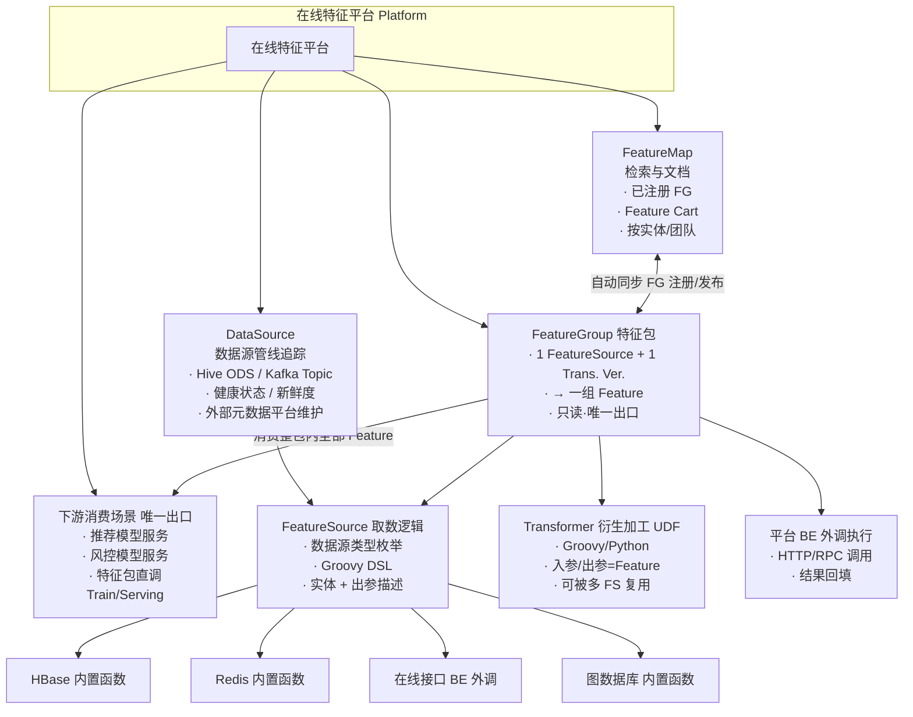
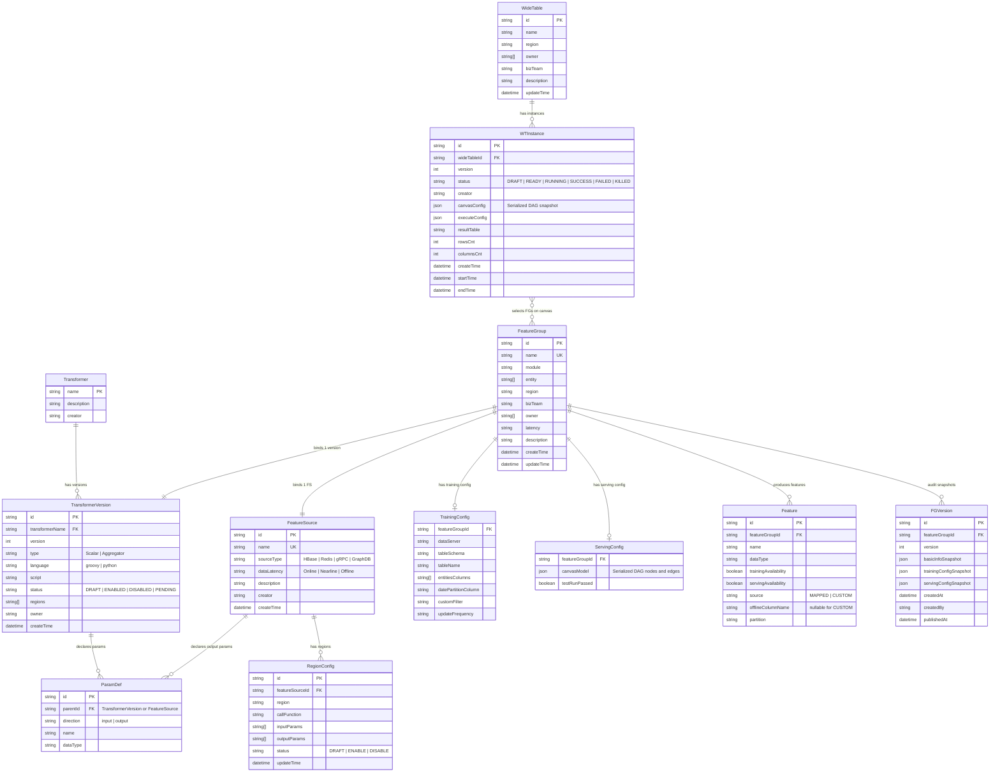
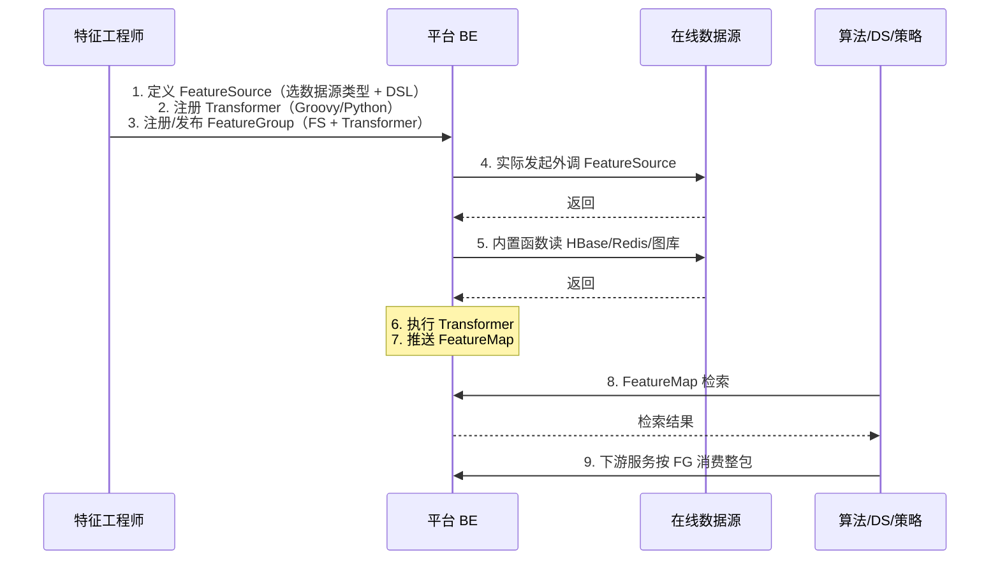
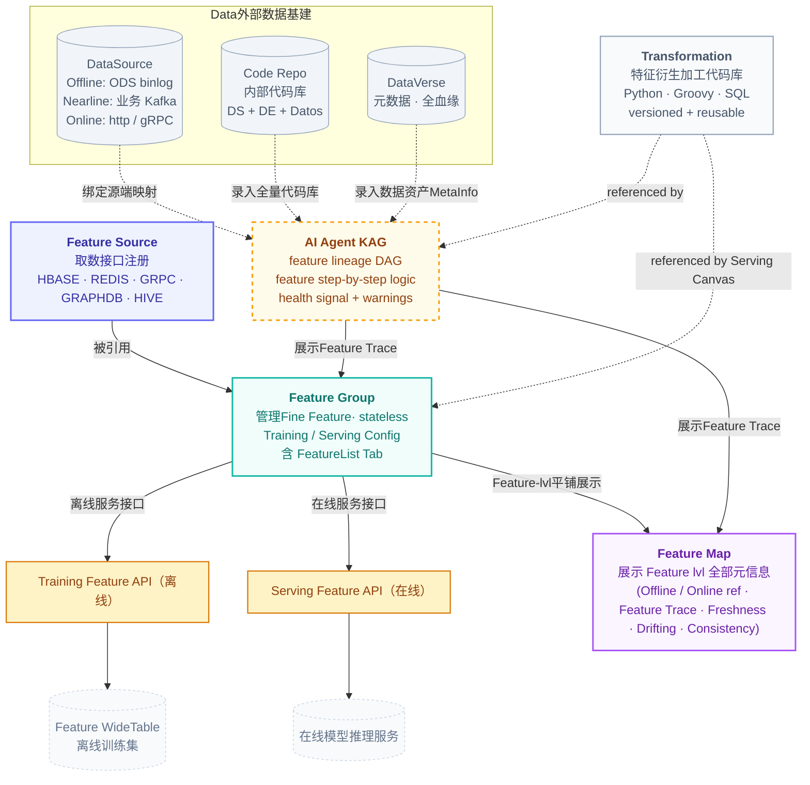

# 在线特征平台架构说明

## 1. 文档目的与范围

- **目的**：定义在线特征平台各层级的概念、边界与协作关系，为算法/特征工程师开发特征包、以及算法/DS/策略检索可用线上/离线特征提供统一理解。
- **范围**：平台侧包含 DataSource、FeatureSource、Transformer、FeatureGroup、FeatureMap 五层（若计入 WideTable/消费层则为六层），以及特征消费层的离线宽表与在线工作流；离在线一致性由 **FeatureGroup 层** 实现。数据准备（如 Spark/Flink 写 HBase）与下游消费场景的耗时与监控不在此文档定义。

**设计边界（重要）**

- **FeatureGroup 特征数据只读**：FG **配置**（Basic Info、Training Config、Serving Config）由平台管理（注册、编辑、发布）；FG **特征数据**不通过平台写入——数据摄入由上游数据管道完成，平台仅按配置读取并加工。
- **数据质量校验**：归属上游；平台不承担写入前/写入时的数据校验。
- **数据分布探查与监控**：归属平台**二期** Scope；在对应层级结构中提及并列出，不做详细设计与展开。
- **FG 版本回退**：本期 Versions Tab 仅作审计记录，不提供自动回滚操作；回退路径归属**二期**。

---

## 2. 总体架构图

- **draw.io 图**：见 **`docs/architecture/在线特征平台-架构图.drawio`**（与本架构说明同目录），可用 [draw.io](https://app.diagrams.net/) 或 VS Code 的 Draw.io Integration 打开编辑；与下文文字说明及第 6 节概念关系一致。


```mermaid
flowchart TB
  subgraph platform [在线特征平台 Platform]
    PlatformNode[在线特征平台]
  end

  FeatureMap["FeatureMap<br/>检索与文档<br/>· 已注册 FG<br/>· Feature Cart<br/>· 按实体/团队"]
  FeatureGroup["FeatureGroup 特征包<br/>· 1 FeatureSource + 1 Trans. Ver.<br/>· → 一组 Feature<br/>· 只读·唯一出口"]
  Downstream["下游消费场景 唯一出口<br/>· 推荐模型服务<br/>· 风控模型服务<br/>· 特征包直调<br/>Train/Serving"]
  DataSource["DataSource<br/>数据源管线追踪<br/>· Hive ODS / Kafka Topic<br/>· 健康状态 / 新鲜度<br/>· 外部元数据平台维护"]

  FeatureSource["FeatureSource 取数逻辑<br/>· 数据源类型枚举<br/>· Groovy DSL<br/>· 实体 + 出参描述"]
  Transformer["Transformer 衍生加工 UDF<br/>· Groovy/Python<br/>· 入参/出参=Feature<br/>· 可被多 FS 复用"]
  PlatformBE["平台 BE 外调执行<br/>· HTTP/RPC 调用<br/>· 结果回填"]

  HBase["HBase 内置函数"]
  Redis["Redis 内置函数"]
  OnlineAPI["在线接口 BE 外调"]
  GraphDB["图数据库 内置函数"]

  PlatformNode --> FeatureMap
  PlatformNode --> FeatureGroup
  PlatformNode --> Downstream
  PlatformNode --> DataSource
  DataSource --> FeatureSource
  FeatureGroup -->|"消费整包内全部 Feature"| Downstream
  FeatureMap <-->|"自动同步 FG 注册/发布"| FeatureGroup
  FeatureGroup --> FeatureSource
  FeatureGroup --> Transformer
  FeatureGroup --> PlatformBE
  FeatureSource --> HBase
  FeatureSource --> Redis
  FeatureSource --> OnlineAPI
  FeatureSource --> GraphDB
```

---

## 3. 离在线语义与一致性（FG 层保障）

### 3.1 在线与离线语义

| 场景 | 配置与存储 | 语义 |
|------|------------|------|
| **在线** | 使用 **FG Online Config**；从 HBase/Redis/图库/在线接口等取数。 | 仅提供**特征最新值**，用于 **Serving 场景**：Model Serving、AI Workflow/Agent 等。 |
| **离线** | 使用 **FG Offline Config**；离线特征存于 Hive，全量历史。 | **历史回溯**仅通过离线宽表/离线存储；用于 **Training 场景**：生成特征训练大宽表 → Model Training、Strategy Backfill 等。 |

**在线 Feature 三类来源**（均通过 FG 层映射到与离线 Feature Column 一致，保障离在线一致性）：(1) **离线导入在线**：Hive 入湖 → HBase/Redis FeatureSource → getHBase 等 Transformer → 与离线 Feature Column 对应的在线 Feature；(2) **Nearline 准实时**：Kafka → Flink → HBase FeatureSource → ScanHBase 等 Transformer → 与离线 ODS 日志加工所得原始离线 Feature Column 对应的在线 Feature；(3) **在线计算**：HTTP/RPC FeatureSource 取 raw Feature → Transformer 计算 → 与离线外调结果 ODS 加工所得原始离线 Feature Column 对应的在线 Feature。

离在线一致性由 **FG 层** 保障：同一 FG 下，**Offline FG Config** 与 **Online FG Config** 在 **Feature 粒度** 做映射，并通过 **Training Availability（离线可用性）** 与 **Serving Availability（在线可用性）** 在平台内显式展示每个 Feature 的离/在线可用性。

### 3.2 训练与 Serving 一致性（避免 Training/Serving Skew）

训练与 Serving 使用**同一 Transformer Version** 逻辑：FG 绑定某一版本的 Transformer，离线宽表与在线服务均基于该版本产出特征，由 FG 层保障，避免 training/serving skew。

### 3.3 Feature Group 的 Train-Serve 双模式

Feature Group 需同时支持 **Train** 与 **Serve** 两种模式，与 3.1 在线/离线语义、3.2 同一 Transformer Version 以及 4.5 的 Offline/Online FG Config 对应一致。

| 模式 | 场景 | 数据来源与职责 |
|------|------|----------------|
| **Train Feature Group（Offline）** | 离线/训练 | 管理并记录常用于生成研发宽表的**离线物理表**（Hive Table + PK + marker、Date Partition 等，见 Offline FG Config）。 |
| **Serve Feature Group（Online）** | 在线/服务 | 由 **Feature Source + Transformation** 的组合逻辑生产：Feature Source 从 HBase/Redis/图库/在线接口取数，经 Transformer 产出 Fine Feature，对应在线特征存储。 |

---

## 4. 层级定义与边界

### 4.0 DataSource 层

| 项目 | 说明 |
|------|------|
| **职责** | 追踪「特征数据从何而来」的原始数据管线元数据。DataSource 不是数据本身，而是对上游数据基础设施（Hive ODS 表、Kafka Topic、在线存储）的**逻辑映射与健康追踪**，作为全链路血缘的 root node。 |
| **边界** | DataSource 的元数据由**外部元数据管理平台**（如 Unity Catalog）维护，Feature Store 通过 T+1 批处理同步，**不在此模块进行 CRUD 管理**。DataSource 模块为只读投影视图。 |
| **定位** | 导航首位——没有数据源就没有特征。DataSource 是特征全链路血缘的起点。 |

**DataSource 三维度**

每个 DataSource 按数据时效性从三个维度描述上游管线：

| 维度 | 配置 | 说明 |
|------|------|------|
| **Offline** | 对应 Hive ODS 表名、分区信息、lastUpdated | 离线批处理管线产出的原始数据 |
| **Nearline** | 对应 Kafka Topic、consumer lag | 准实时流处理管线的中间数据 |
| **Online** | 对应哪个 FeatureSource 消费它、协议类型 | 在线存储（HBase/Redis 等）的连接信息 |

**健康追踪**

| 指标 | 说明 |
|------|------|
| 数据新鲜度 | 上游 Hive 分区 / Kafka offset 的最新更新时间戳 |
| 管线延迟 | OTD（On-Time Delivery）：预期到达时间 vs 实际到达时间 |
| 健康状态 | Healthy / Warning / Offline 三态，基于新鲜度 + 延迟综合判定 |

**与 FeatureSource 的关系**：DataSource 描述「数据从哪来」，FeatureSource 描述「怎么取数据」。一个 FeatureSource 可消费多个 DataSource（如 HBase FeatureSource 背后有 Kafka → Flink → HBase 的完整管线）。

---

### 4.1 FeatureSource 层

| 项目 | 说明 |
|------|------|
| **职责** | 定义「从底层真实数据源取数」的逻辑，是特征包所描述实体与出参特征的**服务出口描述**，供下游按契约消费。 |
| **边界** | 只负责「取数」：选择数据源类型、配置扫描/查询参数、调用平台内置函数或触发 BE 外调，输出原始或半结构化数据供 Transformer 消费。不包含 Spark/Flink 等前置加工，该部分由上游其他平台准备好并写入在线数据源。 |

**数据源类型（枚举）**

MVP 阶段支持以下 4 种数据源类型：

- `HBase`：通过平台内置 Groovy 函数（如 Scan、reverse 等）访问。
- `Redis`：通过平台内置函数访问。
- `gRPC`：HTTP/RPC 等在线接口外调由**平台 BE 负责执行**，FeatureSource 脚本中通过「外调函数」声明入参与结果映射。
- `GraphDB`：通过平台内置函数访问图数据库。

> **Phase 2 扩展**：`MySQL`、`Kafka` 等数据源类型在 MVP 之后按需扩展，不在本期定义。

**脚本形式**

- 基于**内置 Groovy 函数模板的 DSL**，在定义 FeatureSource 时选择数据源类型并填写模板参数/脚本片段。产品侧 FS 创建分为**元信息**与 **Region 配置**两步（见产品原型 §3.1.2）。

**必须清晰表达的内容（作为下游契约）**

- **候选实体**：FeatureSource 声明本数据源关联的候选实体（来自预定义实体枚举，可多实体关联），供 FG 注册时参考。**权威实体归属在 FeatureGroup 层**（见 §4.3），FeatureSource 的候选实体为文档性声明，不作为运行时约束。
- **出参特征**：本 FeatureSource 产出并交给 Transformer 的字段/结构描述，便于下游理解「特征包内有哪些特征、含义与形状」。

**入参**

- 由具体数据源类型与业务决定（如实体 ID 列表、时间范围等），不做全局固化；但需在 FeatureSource 定义处可读、可文档化。

---

### 4.2 Transformer 层

| 项目 | 说明 |
|------|------|
| **职责** | 对 FeatureSource 取到的数据进行**衍生加工**，输出即为 Feature；语言为 Groovy 或 Python。 |
| **边界** | 仅做「输入 → 输出」的转换，不直接访问 HBase/Redis 等存储；若需复杂多源或嵌套逻辑，由算法/特征工程师拆成多个 Transformer 分别注册、在各自 FeatureGroup 中组合使用，平台不显式维护 DAG。 |

**复用关系**

- 一个 **Transformer 可被多个 FeatureGroup 关联使用**（每个 FG 绑定各自的 FeatureSource + 同一个 Transformer 或其不同版本）。
- 嵌套/组合通过「单独注册、多处引用」完成，不设显式 DAG。

**入参 / 出参**

- **入参**：上游 FeatureSource 的输出（或平台约定的统一结构）。
- **出参**：**多个 Feature**，每个 Feature 具备：
  - 名称与含义（与 FeatureGroup 出参描述一致）；
  - **DataType**（Feature 粒度，具体枚举范围 MVP 不强制收口）。

**Entity**

- Entity 为 **FeatureGroup 粒度**，在 FG 注册时由所选的 FeatureSource 的实体定义继承而来，不在 Transformer 上单独定义。

**4.2.1 映射签名（Transformation 基本类型）**

Transformation 提供两种基本映射签名，用于统一离/近/在线算子的输入输出形态：离线/近线时将逻辑按 `column:value` 封装为 Map 或 List&lt;Map&gt; 作为算子输入，将返回的 Map 的 key 打平成表的 column。

| 类型 | 签名 | 语义 | 典型场景 |
|------|------|------|----------|
| **ScalarFunction** | Map → Map | 单行数据到单行数据 | 外数解析：离线/近线时按 column:value 封装成单行 Map 作为算子 input，返参 Map 的 key 打平成表 column。 |
| **AggregateFunction** | List&lt;Map&gt; → Map | 多行数据到单行数据 | 用户 quota 解析：离线/近线时多行按 column:value 封装成 List&lt;Map&gt; 作为算子 input，返参 Map 的 key 打平成表 column。 |

---

### 4.3 FeatureGroup 层

| 项目 | 说明 |
|------|------|
| **职责** | 将「一个 FeatureSource + 一个 Transformer」组装为**一个特征包**，产出该 Transformer 的**全部 Feature**，作为**对外服务唯一出口**。 |
| **边界** | 一个 FG 仅包含 1 个 FeatureSource + 1 个 Transformer；不会将同一 Transformer 的产出拆成多个 FG 注册。**FG 配置由平台管理；特征数据不通过平台写入**，数据摄入由上游数据管道完成。 |
| **Feature Trace** | FG 详情 > Feature List Tab > Action > Trace Modal 承载：Feature 粒度的全链路血缘图谱、AI 提炼的分阶段加工逻辑、异常信号（延迟 / 数据偏移 / 新鲜度）。知识提炼由后台 AI Agent T+1 批处理完成，从外部元数据平台同步，数据存储在 Feature Store。 |

**概念区分（离在线一致性基础）**

- **FeatureSource 产出**：与数据源一致的 **Raw Feature**（未加工）。
- **FeatureGroup 产出**：经某一版本 Transformer 处理后的 **Fine Feature**；FG 通过 Offline/Online Config 在 Feature 粒度映射，并显式展示 **Training Availability（离线可用性）** 与 **Serving Availability（在线可用性）**。
- **Train-Serve 双模式**：FG 同时支持 **Train 模式**（离线物理表管理，见 3.3）与 **Serve 模式**（Feature Source + Transformation 生产）；二者在配置上对应 Offline FG Config 与 Online FG Config。

**入参与出参**

- **入参**：1 个 FeatureSource + 1 个 Transformer（**绑定某一 Transformer Version**）。
- **出参**：该 Transformer 产出的**全部 Feature**（实体在 FG 粒度描述，DataType 在 Feature 粒度）。**实体与 Team 仅在 FG 层级定义与暴露**；FeatureSource 声明候选实体供参考（见 §4.1），FG 注册时从候选实体中选取并确定权威绑定。

**生命周期与发布**

- **无状态设计**：FG 不维护 Draft / Online / Online Changing 等状态，配置变更直接生效。
- **版本**：**FG 无 Version 概念，更新即 Force Release**。Transformer 有版本管理，FG 绑定某一 Transformer Version。

**权限与可见性**

- FG 有 **user** 与 **biz_team** 管理。
- 默认 **all team** 可见、可用。
- 敏感数据可改为**指定 biz_team**：仅该团队可用；其他团队用户仅在 **FeatureMap 可见、不可用**。

---

### 4.4 FeatureMap 层

| 项目 | 说明 |
|------|------|
| **职责** | 对**已注册的 FeatureGroup** 做集中检索与文档展示，供算法/DS/策略查找「有哪些可用的线上/离线特征」；支持** Feature 粒度**勾选与** Feature Cart** 能力。 |
| **边界** | 仅做检索与文档，**不**作为下游模型或服务的特征拉取接口；下游的**唯一出口是 FeatureGroup**（按特征包维度消费包内全部特征）。 |

**数据来源与更新**

- 由 **FeatureGroup 注册/发布** 驱动：FG 注册或发布时**推送**更新到 FeatureMap（Auto Sync & Indexing），保证与当前线上可用的 FG 一致。

**能力**

- 按实体、biz_team、可见性等检索；
- 展示 FG 及其包含的 Feature、实体、DataType、权限与可见性（含「仅可见不可用」的说明）；
- **Feature Cart**：用户可勾选 Feature 级特征资产，左下角购物车图标展示已选 Feature 数量；点击购物车可将所选 Feature **快速注册到消费场景**，如「特征离线宽表画布」「特征在线服务 Workflow 画布」等。

---

### 4.5 Feature Group 与配置层

以下为平台提供的配置与元信息能力，用于与 FE 对接接口定义，支撑用户在前端 Web 页面的操作。**数据分布探查与监控**为平台二期 Scope，在此仅列出、不展开详细设计。

| 类别 | 内容 |
|------|------|
| **Metainfo** | Region + Entity；Owner + Multi-Project；Freshness + Desc。 |
| **Offline FG Config** | Hive Table + PK + marker；Date Partition Column；Region Filter 等。 |
| **Online FG Config** | 绑定 1 个 FeatureSource；绑定某一 Transformer Version；将输出映射到离线 Feature（Map Outputs to Offline Fts，映射规则详见 **§4.7**）。 |
| **FeatureList** | Name + Datamap Info（DataType、Partition）；**Training Availability**；**Serving Availability**；Serving Script；Add Online Computing Features。 |
| **运维与追溯** | Used By（下游引用资产：FG ↔ FS ↔ T ↔ WideTable）；Change Logs；Serving Test Run + Test History。 |
| **二期** | 数据分布探查与监控（列出在对应层级，不做详细设计与展开）。 |

---

### 4.6 FeatureSource 出参契约（FS → Transformer 数据结构）

FeatureSource 的执行输出是 Transformer 的输入。为保证二者可验证对接，平台定义如下契约：

**输出格式**

| Transformation 类型 | FS 出参结构 | 说明 |
|---------------------|-------------|------|
| **ScalarFunction** | `Map<String, Object>` | 单行 key-value，key 为 Output Param Name，value 为对应值 |
| **AggregateFunction** | `List<Map<String, Object>>` | 多行，每行结构同上 |

**注册时校验（FG 创建时触发）**

创建 FeatureGroup 并绑定 FS + Transformer 时，平台应执行以下校验：

1. FS 声明的 **Output Params** 名称集合必须**覆盖** Transformer 声明的 **Input Params** 名称集合（允许 FS 产出多余字段，Transformer 按需取用）。
2. Transformer 的 **Transformation Type**（Scalar / Aggregate）与 FS 出参的结构形态匹配（Scalar → Map；Aggregate → List&lt;Map&gt;）。
3. 校验不通过时拒绝 FG 创建，返回具体不匹配字段列表。

**运行时契约**

FS 实际执行返回的结构须与声明一致；若运行时返回的 key 集合不含 Transformer 所需 Input Param，执行引擎按 **Transformer 层错误处理策略**（见 §4.8）返回错误。

---

### 4.7 离在线 Feature 映射规则（Offline ↔ Online）

此映射是离在线一致性的核心机制，对应 Online FG Config 中的「Map Outputs to Offline Fts」。

**映射方式**

1. **自动按名称匹配（Auto-match）**：Serving Canvas END 节点的出参名与 Training Config 的 Feature 列表按**名称精确匹配**。匹配成功的标记为 **Mapped Feature**。
2. **手动指定（Manual Override）**：END 节点出参名支持 AutoComplete（数据源为 Training Feature 列表），也**允许手填列表外的名称**。选自列表内的为 **Mapped Feature**；列表外的为 **Custom Feature**（额外注册的 Serving-only 特征）。

**映射结果与 Availability 派生**

| Feature 类型 | Training Availability | Serving Availability | 说明 |
|-------------|----------------------|---------------------|------|
| **Mapped Feature** | 由 Offline FG Config 决定（有 Hive 表配置 → true） | 由 Online FG Config 决定（有 Serving Canvas 配置 → true） | 离在线一一对应 |
| **Custom Feature** | false | true | 仅在线可用，无离线对应列 |
| 仅离线 Feature（Training Config 中有、Serving Canvas 中未映射） | true | false | 仅离线可用 |

**校验规则**

- FG 进入 Online 时，平台应检查 Mapped Feature 的离在线名称映射一致性。
- Custom Feature 不参与离在线一致性校验，但在 FeatureMap 中标记为 Serving-only。

---

### 4.8 Transformer 测试与安全契约

**测试定义**

一次 Transformer「通过测试」需满足：

1. 在平台提供的**沙箱环境**中成功执行，返回状态为 `success`。
2. 返回的 Output Params 集合**覆盖** Transformer 声明的全部 Output Params（名称匹配）。
3. 执行时间未超过**超时阈值**（MVP 默认 30 秒，后续可配置）。

**沙箱资源限制（MVP 默认值）**

| 资源 | 限制 | 说明 |
|------|------|------|
| 内存 | 256 MB | 单次 Transformer 执行上限 |
| CPU 时间 | 30 秒 | 超时则强制终止，返回 FAILED |
| 网络 | 禁止 | Transformer 不可直接访问外部网络；数据由 FS 出参提供 |
| 文件系统 | 只读 + 临时目录 | 不可写入持久存储 |

**安全模型**

- **Groovy**：运行于受限类加载器，禁止 `System.exit`、`Runtime.exec`、直接 I/O 类访问。
- **Python**：运行于隔离容器/进程，禁止 `os.system`、`subprocess`、网络库。
- 可用 API 表面：平台提供的标准库（数学、字符串、集合操作）+ 声明的 Input Params。

---

## 5. 离线宽表与 Point-in-Time Join

### 5.1 多 FG、不同更新节奏下的 Join

若参与宽表的多个 FG 更新节奏不同（如有的日更、有的小时更），**必须做 point-in-time correct join**，即平台提供的 **Smart Join**：在某一实体、某一事件时间点上，仅使用「不晚于该时间」的特征值，避免未来信息泄露。

- **event_time**：在**特征宽表生成画布**中由用户指定，用于控制 join 的时间语义。
- **Key Table（Spine / Spine Group）**：即 join 的「左表」，定义「为哪些实体、在哪些时间点」取特征（可含 label）。由**离线特征宽表画布的用户提供**，是一张 **External Feature Table（Hive）**；系统以**只读 FG** 形式参与 join/训练，不写入该表。

### 5.2 离线宽表流程（画布）

FG Selection（来自 Feature Cart/画布所选）→ Offline FG Config → **Key Table（Spine）** → **Smart Join（point-in-time correct）** → **Data Ingestion**（曾用名 Data Sink）。Raw 数据落库后，**Data Cleaning** 节点上可配置可选**数据清洗**（Fillna、Value Mapping / Case When）；开关关闭时仍保留节点占位、执行侧可跳过清洗；开启后按平台规则写入 **Cleaned** 目标表（详见《产品原型图》§3.5.2 与 `docs/design/widetable-canvas-nodes-revamp.md`）。

**产品侧入口**：WideTable 列表页采用**嵌套二级 Table**——外层管理 TS 元信息（Edit / Add Instance / Delete），内层展示各 Instance Version 的执行详情（Edit / Trigger / Report + More<Kill, Copy, Task Link>）。用户通过 Modal 弹窗完成 Add TS / Edit TS / Add Instance / Copy Instance（含多选 Owner、Biz Team 映射、InstanceVersion 自动递增），OK 后跳转 **Dify 式拖拽节点画布页**。画布包含节点类型：**Frame Table**（唯一）、**Feature Group**（至少一个）、**Data Ingestion**（唯一，Raw 侧回显）、**Data Cleaning**（唯一，清洗配置与 Clean 侧回显）；**Execute Config** 配置 Resource / Queue Priority / Scheduler 等；**Report 模板**由后端内置策略处理，前端不配置。节点点击后右侧 Drawer 展示配置。顶栏 Save / Check / Submit 控制 Instance 状态（DRAFT → READY）。Instance 状态机：DRAFT → READY → RUNNING → SUCCESS / FAILED / KILLED。

---

## 6. 实体关系模型（ER Diagram）


```mermaid
erDiagram
    FeatureSource {
        string id PK
        string name UK
        string sourceType "HBase | Redis | gRPC | GraphDB"
        string dataLatency "Online | Nearline | Offline"
        string description
        string creator
        datetime createTime
    }

    RegionConfig {
        string id PK
        string featureSourceId FK
        string region
        string callFunction
        string[] inputParams
        string[] outputParams
        string status "DRAFT | ENABLE | DISABLE"
        datetime updateTime
    }

    Transformer {
        string name PK
        string description
        string creator
    }

    TransformerVersion {
        string id PK
        string transformerName FK
        int version
        string type "Scalar | Aggregator"
        string language "groovy | python"
        string script
        string status "DRAFT | ENABLED | DISABLED | PENDING"
        string[] regions
        string owner
        datetime createTime
    }

    ParamDef {
        string id PK
        string parentId FK "TransformerVersion or FeatureSource"
        string direction "input | output"
        string name
        string dataType
    }

    FeatureGroup {
        string id PK
        string name UK
        string module
        string[] entity
        string region
        string bizTeam
        string[] owner
        string latency
        string description
        datetime createTime
        datetime updateTime
    }

    TrainingConfig {
        string featureGroupId FK
        string dataServer
        string tableSchema
        string tableName
        string[] entitiesColumns
        string datePartitionColumn
        string customFilter
        string updateFrequency
    }

    ServingConfig {
        string featureGroupId FK
        json canvasModel "Serialized DAG nodes and edges"
        boolean testRunPassed
    }

    Feature {
        string id PK
        string featureGroupId FK
        string name
        string dataType
        boolean trainingAvailability
        boolean servingAvailability
        string source "MAPPED | CUSTOM"
        string offlineColumnName "nullable for CUSTOM"
        string partition
    }

    FGVersion {
        string id PK
        string featureGroupId FK
        int version
        json basicInfoSnapshot
        json trainingConfigSnapshot
        json servingConfigSnapshot
        datetime createdAt
        string createdBy
        datetime publishedAt
    }

    WideTable {
        string id PK
        string name
        string region
        string[] owner
        string bizTeam
        string description
        datetime updateTime
    }

    WTInstance {
        string id PK
        string wideTableId FK
        int version
        string status "DRAFT | READY | RUNNING | SUCCESS | FAILED | KILLED"
        string creator
        json canvasConfig "Serialized DAG snapshot"
        json executeConfig
        string resultTable
        int rowsCnt
        int columnsCnt
        datetime createTime
        datetime startTime
        datetime endTime
    }

    FeatureSource ||--o{ RegionConfig : "has regions"
    Transformer ||--o{ TransformerVersion : "has versions"
    TransformerVersion ||--o{ ParamDef : "declares params"
    FeatureSource ||--o{ ParamDef : "declares output params"
    FeatureGroup ||--|| FeatureSource : "binds 1 FS"
    FeatureGroup ||--|| TransformerVersion : "binds 1 version"
    FeatureGroup ||--o| TrainingConfig : "has training config"
    FeatureGroup ||--o| ServingConfig : "has serving config"
    FeatureGroup ||--o{ Feature : "produces features"
    FeatureGroup ||--o{ FGVersion : "audit snapshots"
    WideTable ||--o{ WTInstance : "has instances"
    WTInstance }o--o{ FeatureGroup : "selects FGs on canvas"
```

**关键约束**

- FeatureGroup 与 FeatureSource 为 **1:1** 绑定（一个 FG 仅绑定一个 FS）。
- FeatureGroup 与 TransformerVersion 为 **1:1** 绑定（一个 FG 绑定某一特定版本）。
- 一个 Transformer 可被**多个 FeatureGroup** 复用（通过不同版本或同一版本）。
- WTInstance 与 FeatureGroup 为 **M:N**（一个 Instance 画布可选多个 FG；一个 FG 可被多个 Instance 引用）。
- Feature 归属唯一的 FeatureGroup；source 为 MAPPED 时 offlineColumnName 非空。

---

## 7. 概念关系小结

数据源从外部元数据平台维护的 DataSource → FeatureSource 取数 → Transformer 加工 → FeatureGroup 组装 → FeatureMap 检索 / WideTable 消费。

```
┌─────────────────────┐  ┌─────────────────────┐
│  FeatureSource      │  │  Transformer         │
│  · 数据源类型枚举     │  │  · Groovy / Python   │
│  · 出参描述 (Raw)    │  │  · 版本管理          │
│  · HBase/Redis/     │  │  · 出参 = 多 Feature  │
│    在线接口/图库     │  │  · 可被多 FG 复用     │
└──────────┬──────────┘  └──────────┬──────────┘
           │ 入参取数               │ 入参加工
           └────────────┬────────────┘
                        ▼
┌──────────────────────────────────────────────────────────────────────────────┐
│  FeatureGroup (特征包) · 对外服务唯一出口 · 只读（注册而来）                     │
│  · 入参: 1 FeatureSource + 1 Transformer Version                              │
│  · 产出: 一组 Fine Feature；注册/发布后 自动同步 → FeatureMap                   │
│  · Train: 离线物理表；Serve: FS + Transformation                              │
│  · 实体、Team = FG 粒度；无 FG Version，更新即 Force Release                    │
└──────────────────────────────────────────────────────────────────────────────┘
                        │ 输出：自动同步
                        ▼
┌─────────────────────┐
│  FeatureMap         │  · Feature Cart → 下游消费场景
│  · 检索与文档        │
│  · 可见性/权限展示   │
└─────────────────────┘
```

---

## 8. 数据流简图


```mermaid
sequenceDiagram
  participant FE as 特征工程师
  participant BE as 平台 BE
  participant DS as 在线数据源
  participant Consumer as 算法/DS/策略

  FE->>BE: 1. 定义 FeatureSource（选数据源类型 + DSL）<br/>2. 注册 Transformer（Groovy/Python）<br/>3. 注册/发布 FeatureGroup（FS + Transformer）
  BE->>DS: 4. 实际发起外调 FeatureSource
  DS-->>BE: 返回
  BE->>DS: 5. 内置函数读 HBase/Redis/图库
  DS-->>BE: 返回
  Note over BE: 6. 执行 Transformer<br/>7. 推送 FeatureMap
  Consumer->>BE: 8. FeatureMap 检索
  BE-->>Consumer: 检索结果
  Consumer->>BE: 9. 下游服务按 FG 消费整包
```

---


## 8.1 数据资产流转与平台边界全景图


```mermaid
flowchart TD
  subgraph EXT["Data外部数据基建"]
    DV[("DataVerse<br/>元数据 · 全血缘")]
    CR[("Code Repo<br/>内部代码库<br/>DS + DE + Datos")]
    SRC[("DataSource<br/>Offline: ODS binlog <br/> Nearline: 业务 Kafka <br/> Online: http / gRPC")]
  end

  XFORM["<b>Transformation</b><br/>特征衍生加工代码库<br/>Python · Groovy · SQL <br/>versioned + reusable"]

  KAG["<b>AI Agent KAG</b><br/>feature lineage DAG<br/>feature step-by-step logic<br/>health signal + warnings"]

  FS["<b>Feature Source</b><br/>取数接口注册<br/>HBASE · REDIS · GRPC · GRAPHDB · HIVE"]

  FG["<b>Feature Group</b><br/>管理Fine Feature· stateless<br/>Training / Serving Config<br/>含 FeatureList Tab"]

  TAPI["Training Feature API（离线）"]
  SAPI["Serving Feature API（在线）"]

  WT[("Feature WideTable<br/>离线训练集")]
  MS[("在线模型推理服务")]

  FMAP["<b>Feature Map</b><br/>展示 Feature lvl 全部元信息<br/>(Offline / Online ref · Feature Trace · Freshness · Drifting · Consistency)"]

  SRC -.->|绑定源端映射| KAG
  CR -.->|录入全量代码库| KAG
  DV -.->|录入数据资产MetaInfo| KAG
  FS -->|被引用| FG
  KAG -->|展示Feature Trace| FG
  FG -->|离线服务接口| TAPI
  FG -->|在线服务接口| SAPI
  TAPI --> WT
  SAPI --> MS

  XFORM -.->|referenced by| KAG
  XFORM -.->|referenced by Serving Canvas| FG

  FG -->|Feature-lvl平铺展示| FMAP
  KAG -->|展示Feature Trace| FMAP

  classDef kag fill:#fffbeb,stroke:#f59e0b,stroke-width:2px,stroke-dasharray: 5 5,color:#92400e
  classDef fs fill:#eef2ff,stroke:#6366f1,stroke-width:2px,color:#3730a3
  classDef fg fill:#f0fdfa,stroke:#14b8a6,stroke-width:2px,color:#0f766e
  classDef fmap fill:#faf5ff,stroke:#a855f7,stroke-width:2px,color:#6b21a8
  classDef xform fill:#f8fafc,stroke:#94a3b8,stroke-width:1.5px,color:#475569
  classDef ext fill:#f1f5f9,stroke:#94a3b8,stroke-width:1px,color:#475569
  classDef api fill:#fef3c7,stroke:#d97706,stroke-width:1.5px,color:#92400e
  classDef consumer fill:#f8fafc,stroke:#cbd5e1,stroke-width:1px,stroke-dasharray:3 3,color:#64748b

  class KAG kag
  class FS fs
  class FG fg
  class FMAP fmap
  class XFORM xform
  class DV,SRC,CR ext
  class TAPI,SAPI api
  class WT,MS consumer
```

> **图例**：外部数据基建（DataVerse + Code Repo + DataSource）→ AI Agent KAG 提炼血缘/逻辑/健康信号 → Feature Group 组装 → Training/Serving API 出口 → 下游消费（WideTable / 模型推理）。Feature Source 被 FG 引用；Transformation 被 KAG 与 FG Serving Canvas 引用；Feature Map 作为平铺展示层，汇总 FG 与 KAG 的全量元信息。


## 9. 与上下游的边界（备忘）

| 环节 | 是否属于本平台 | 说明 |
|------|----------------|------|
| T+1 导入 HBase / Flink 写 HBase | 否 | 上游数据准备，由其他平台负责 |
| FeatureGroup 特征数据写入 | 否 | FG 配置由平台管理；**特征数据不通过平台写入**，由上游数据管道完成 |
| 数据质量校验（写入前/写入时） | 否 | 归属**上游** |
| 数据分布探查与监控 | 二期 | 平台二期 Scope，在对应层级列出、不展开 |
| FeatureSource 内置函数读 HBase/Redis/图库 | 是 | 平台提供并维护 |
| 在线接口外调（HTTP/RPC） | 平台 BE 执行 | 在 FeatureSource 中通过外调函数声明，BE 负责调用 |
| Transformer 开发与注册 | 是 | 算法/特征工程师负责 |
| FeatureGroup 注册、发布（Force Release） | 是 | 平台能力，Admin 确认后生效；FG 无 Version，更新即 Force Release |
| FeatureMap 检索、Feature Cart、画布注册 | 是 | 检索与文档；购物车可注册到离线宽表/在线 Workflow 画布 |
| 上游数据管线元数据维护（Hive/Kafka/在线存储） | 否 | 由外部元数据管理平台（Unity Catalog）维护；Feature Store T+1 同步，AI Agent 提炼后存为 Feature Trace |
| 下游 Training：Model Training、Strategy Backfill | 否 | 使用离线宽表；耗时与监控由下游负责 |
| 下游 Serving：Model Serving、AI Workflow/Agent | 否 | 使用 FG 在线特征；耗时与监控由下游负责 |

---

## 10. 跨模块状态枚举命名约定

各模块的状态枚举值与展示文案应在 API 与前端保持统一。以下为平台级约定：

| 内部枚举值 | 展示文案 | 适用模块 | Tag 颜色 |
|-----------|----------|----------|----------|
| `DRAFT` | DRAFT | FS / Transformation / FG / WideTable Instance | 灰色 |
| `ONLINE` | ONLINE | FS Region（启用态） | 绿色 |
| `OFFLINE` | OFFLINE | FS Region（下线态） | 红色 |
| `ENABLED` | ENABLED | Transformation Version（启用态） | 绿色 |
| `DISABLED` | DISABLED | Transformation Version（下线态） | 红色 |
| `PENDING` | PENDING | Transformation Version（审核中） | 橙色 |
| `READY` | READY | WideTable Instance（已提交待执行） | 黄色 |
| `RUNNING` | RUNNING | WideTable Instance（执行中） | 蓝色 |
| `SUCCESS` | SUCCESS | WideTable Instance（执行成功） | 绿色 |
| `FAILED` | FAILED | WideTable Instance（执行失败） | 红色 |
| `KILLED` | KILLED | WideTable Instance（手动终止） | 红色 |

> **原则**：内部枚举值与展示文案一致（避免 ENABLE→ONLINE 等映射转换）；FS Region 选用 ONLINE/OFFLINE 而非 ENABLE/DISABLE 作为展示文案，以匹配产品原型图。

---

## 11. FeatureSource 执行 SLA 与错误处理

### 11.1 超时策略（MVP 默认值，可在 FS Region Config 注册时覆盖）

| 数据源类型 | 默认超时 | 说明 |
|-----------|----------|------|
| HBase | 200 ms | 内置函数读取 |
| Redis | 100 ms | 内置函数读取 |
| gRPC | 1000 ms | BE 外调；外部接口不确定性高 |
| GraphDB | 500 ms | 内置函数读取 |

### 11.2 重试策略

| 参数 | 默认值 | 说明 |
|------|--------|------|
| 最大重试次数 | 1（共执行 2 次） | 首次失败后重试一次 |
| 重试间隔 | 50 ms | 固定间隔（MVP 不做指数退避） |
| 可重试错误类型 | 超时、网络不可达 | 业务错误（如 key 不存在）不重试 |

### 11.3 降级策略（可在 FG 注册时配置）

| 策略 | 行为 | 适用场景 |
|------|------|----------|
| **fail-fast**（默认） | FS 执行失败 → 整个 FG 请求返回错误 | 数据强依赖场景 |
| **return-default** | FS 执行失败 → 按 Feature 声明的 DataType 返回零值/空值 | 可容忍缺失的辅助特征 |
| **return-cached** | FS 执行失败 → 返回上次成功的缓存值（需平台维护最近一次成功结果） | 高可用场景（Phase 2） |

### 11.4 熔断（gRPC 数据源适用）

对 gRPC 类数据源启用**熔断器**：连续 N 次（默认 5 次）超时或网络错误后，后续请求直接按降级策略返回，持续 T 秒（默认 30 秒）后进入半开状态，放行单次请求探测恢复。

---

## 12. WideTable Instance 生命周期管理

### 12.1 重试与 Re-trigger

- **FAILED / KILLED** 状态的 Instance 可通过 **Trigger** 操作重新执行（状态 → RUNNING）。
- 无自动重试；所有 Re-trigger 为用户手动操作。
- 无重试次数上限限制（用户可反复 Trigger）。

### 12.2 并发执行

- **同一 WideTable 下**，同一时刻仅允许**一个 Instance 处于 RUNNING 状态**。
- 若 Instance V1 正在 RUNNING，对 V2 执行 Trigger 时，平台应返回 409 错误并提示"该 WideTable 下已有 Instance 正在执行"。
- 不同 WideTable 之间的 Instance 可并行执行（受 Queue Priority 和集群资源调度约束）。

### 12.3 Instance 删除与清理

- **用户侧**：本期不支持单独删除 Instance；仅支持删除整个 WideTable（级联删除所有 Instance）。
- **平台侧**：Instance 执行记录**永久保留**（MVP）；Phase 2 可按 TTL 策略（如保留最近 90 天/最近 50 个版本）自动清理。

### 12.4 结果表（Hive）生命周期

- 每次成功执行会产出一张 Hive Result Table（Raw）和可选的 Clean Table。
- **结果表由 WideTable 所属 Biz Team 管理**，平台不自动删除。
- Phase 2：可配置 **Result Table TTL**（如 Hive 分区保留策略），到期后平台触发清理任务。

---

## 13. 平台可观测性（Observability）

### 13.1 结构化事件日志

所有状态转移操作必须记录结构化日志，包含以下字段：

| 字段 | 类型 | 说明 |
|------|------|------|
| `event_id` | string | 唯一事件 ID |
| `timestamp` | datetime | UTC 时间戳 |
| `actor` | string | 操作者（user email 或 system） |
| `entity_type` | string | `FeatureSource` / `RegionConfig` / `Transformer` / `FeatureGroup` / `WideTable` / `WTInstance` |
| `entity_id` | string | 实体 ID |
| `action` | string | `create` / `update` / `delete` / `enable` / `disable` / `publish` / `sync` / `trigger` / `kill` 等 |
| `old_status` | string | 变更前状态（nullable） |
| `new_status` | string | 变更后状态（nullable） |
| `metadata` | json | 操作相关的上下文（如变更字段摘要、错误信息） |

### 13.2 关键业务指标（Metrics）

| 指标 | 维度 | 说明 |
|------|------|------|
| `fg_serving_latency_ms` | FG ID, Region, percentile (p50/p95/p99) | 单次 FG 在线服务端到端延迟 |
| `fs_execution_latency_ms` | FS ID, Region, Source Type | FS 取数延迟 |
| `fs_error_rate` | FS ID, Region | FS 执行错误率（含超时） |
| `transformer_execution_latency_ms` | Transformer Name, Version | Transformer 执行延迟 |
| `fg_request_count` | FG ID, Region | FG 在线请求 QPS |
| `widetable_job_duration_s` | WideTable ID, Instance Version | WideTable 离线任务执行时长 |
| `datasource_freshness_min` | DataSource ID, Region | 上游数据分区最新时间戳距当前时间（分钟） |
| `widetable_job_status_count` | Status | 各状态 Instance 计数 |

### 13.3 告警规则（MVP 内置，可扩展）

| 规则 | 触发条件 | 动作 |
|------|----------|------|
| FG Serving 延迟异常 | `fg_serving_latency_ms` p99 > 阈值（默认 500ms），连续 5 分钟 | 通知 FG Owner |
| FS 错误率飙升 | `fs_error_rate` > 阈值（默认 5%），连续 3 分钟 | 通知 FS Creator + FG Owner |
| WideTable 任务失败 | Instance 进入 FAILED 状态 | 通知 WideTable Owner |
| FS 熔断开启 | gRPC 数据源熔断器开启 | 通知 FS Creator + 相关 FG Owner |

### 13.4 审计日志

审计日志基于 §13.1 结构化事件日志，额外满足：

- **不可变**：写入后不可修改或删除。
- **保留期限**：至少 1 年（合规要求）。
- **可查询**：支持按 entity_type、entity_id、actor、时间范围检索。
- **与 FG Versions 关联**：每次 FG Version 生成时，在审计日志中记录完整的配置快照 diff。

---

*文档版本：MVP；数据分布探查与监控、FG 版本回退为二期 Scope，仅列出不展开。*
