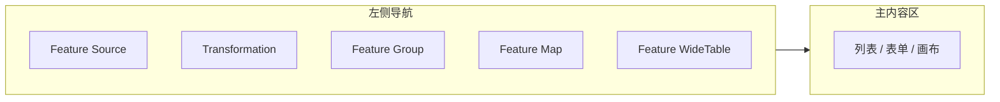
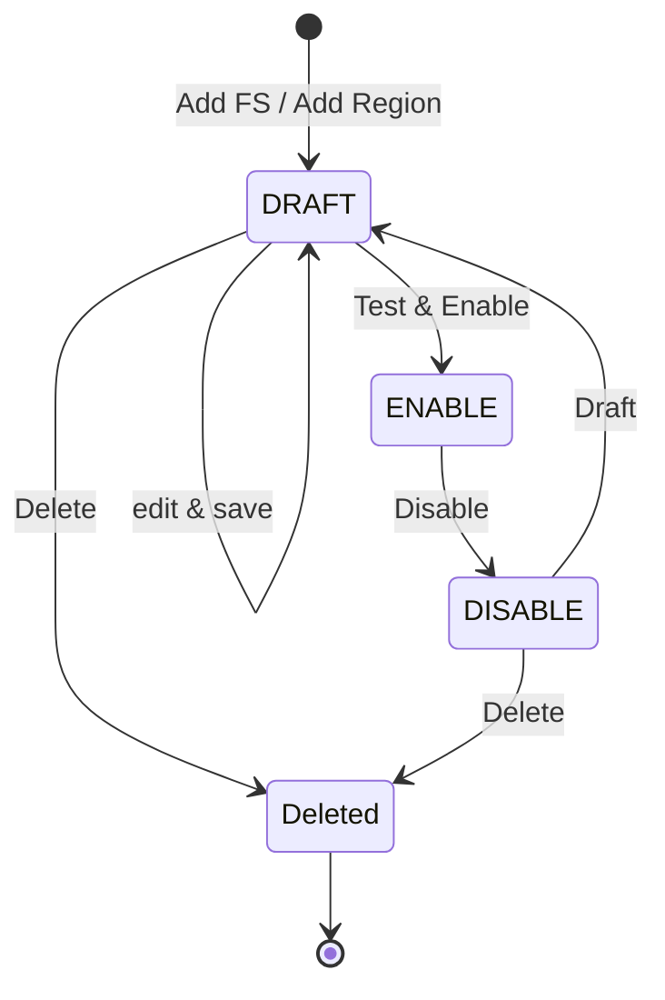
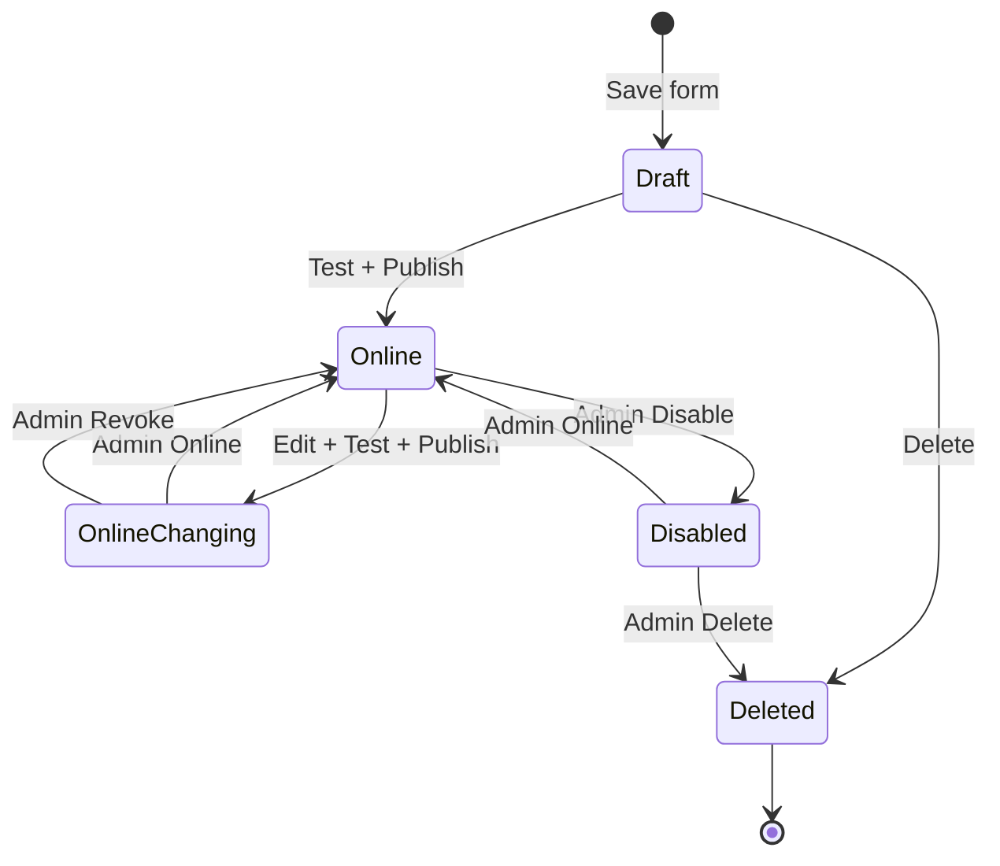
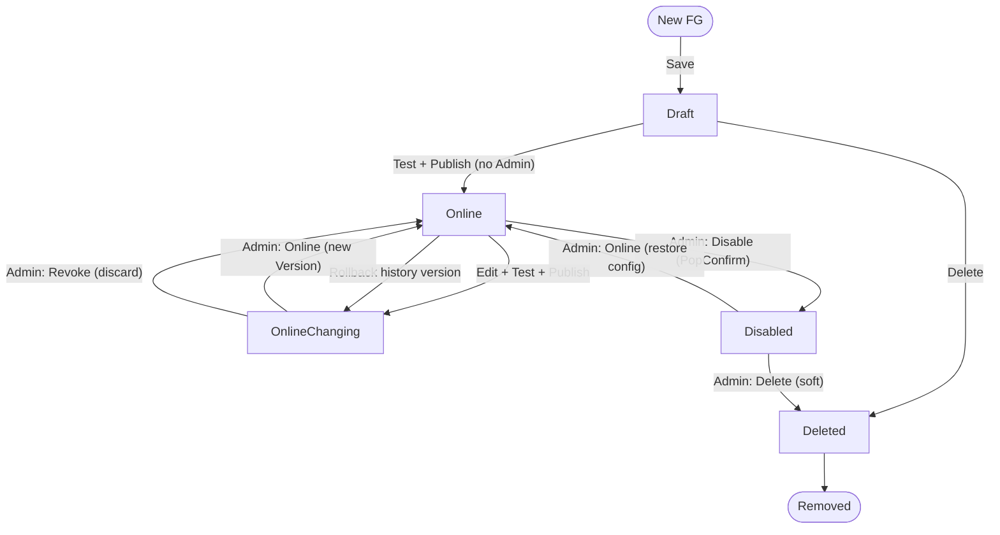

# 在线特征平台 — 产品原型图

面向 Front-End Engineer 与 UI/UX 的页面与交互规格说明，用于按文档在 Figma 中还原原型并实现前端。页面结构严格对齐 [产品与交付示意图.md §1.2 特征平台产品页面结构](../prd/产品与交付示意图.md)；产品架构、操作主流程与数据流转见该文档，本文不重复。

---

## 1. 文档说明

| 项目 | 说明 |
|------|------|
| **读者** | Front-End Engineer、UI/UX 设计师 |
| **与《产品与交付示意图》** | 本文仅展开 **§1.2 产品页面结构** 的界面与交互；架构图、主流程、数据流以该文档为准 |
| **与《在线特征平台架构说明》** | 术语与四层边界（FeatureSource / Transformer / FeatureGroup / FeatureMap）及 §5 离线宽表以该文档为准 |

---

## 2. 页面结构总览

### 2.1 五大模块与导航

与 §1.2 一一对应：

1. **Feature Source** — 数据源管理（列表 + 可展开子行 / Modal 弹窗创建·编辑·复制）
2. **Transformation** — 转换脚本管理（列表 / 注册 / 版本）
3. **Feature Group** — 特征包管理（列表 / 注册·编辑 / 衍生 Tab）
4. **Feature Map** — 特征检索与文档（检索结果 / Feature Cart）
5. **Feature WideTable** — 离线宽表画布（列表 / 画布占位）

导航形式：**左侧栏**。支持通过箭头小图标 **折叠 / 展开**；折叠后仅展示各模块 **图标（icon）**，不展示模块名称。



### 2.2 用户与入口关系

- **Feature Map** 与 **Feature Group** 不互相跳转：FM 面向特征消费用户，FG 面向特征生产用户，入口分离。
- **Feature Cart** 仅出现在 Feature Map 内：当用户勾选至少一个 feature 的复选框时，购物车图标在 **FM 左下角** 出现；未勾选时隐藏，但占位常驻（同一位置）。

---

## 3. 分模块原型说明

### 3.1 Feature Source

**职责**：与《产品与交付示意图》§1.2.1、架构说明 §4.1 一致；承载数据源定义（类型、DSL、实体与出参）。一个 Feature Source 可包含多个 **Region 维度的配置**（子行），每个 Region 配置独立管理 Call Function、Input/Output Params、Region Status。

#### 3.1.0 Region 状态机

每个 Region 配置具有独立的 Status，生命周期包含 **DRAFT → ENABLE（展示为 ONLINE）→ DISABLE（展示为 OFFLINE）→ DRAFT / (Deleted)**：



| 状态 | 展示文案 | Tag 颜色 | 含义 |
|------|----------|----------|------|
| **DRAFT** | DRAFT | `tag-gray` | 新建后初始状态，尚未启用 |
| **ENABLE** | ONLINE | `tag-green` | 已启用，可被 Feature Group 关联消费（不可编辑） |
| **DISABLE** | OFFLINE | `tag-red` | 已下线，不可被下游消费 |
| **(Deleted)** | — | — | 软删除，界面不再显示 |

**Manage 菜单（子行 Action > Manage，含 Enable / Disable / Draft）**：

| 操作 | DRAFT | ENABLE（ONLINE） | DISABLE（OFFLINE） |
|------|-------|------------------|---------------------|
| Enable | 可点 | 置灰（DRAFT only） | 置灰（DRAFT only） |
| Disable | 置灰（ENABLE only） | 可点（需 PopConfirm + 下游依赖校验） | 置灰（ENABLE only） |
| Draft | 置灰（DISABLE only） | 置灰（DISABLE only） | 可点 |

#### 3.1.1 列表页

- **筛选区**（主内容区顶部）
  - 筛选项：Feature Source 名称（模糊搜索）、Source Type（下拉：HBase / Redis / gRPC / GraphDB）、Region（下拉：ID / PH / BR / TH / MX / SHOPEE_SG）、Creator（模糊搜索）。
  - 操作：**Reset**（灰）、**Search**（主色 `#13c2c2`）。
- **工具栏**
  - 主操作：**+ Add Feature Source** 按钮（主色），点击打开 **Feature Source 元信息 Modal**（见 §3.1.2），仅填写 FS 名、SourceType、Data Latency、Description，提交后新增一级行。
- **主表格**
  - 列：（展开按钮）、Feature Source（名称）、Source Type、Region（多 Tag，如 ID + TH）、Creator、CreateTime、Description（truncate 省略，hover 显示完整）、**Action**。
  - **Action**：**Add**（向该 FS 添加新 Region 配置，打开 Region Config Modal）、**Edit**（打开 Feature Source 元信息弹窗，编辑当前 FS 的 Feature Source 名、SourceType、Data Latency、Description）、**Test**、**Delete**（删除整个 FS，见 §3.1.3；点击时校验所属二级 Region 配置 Status 是否均非 ONLINE，若存在 ONLINE 则拒止并提示）。
  - **无行选复选框**，不支持批量操作。
  - 默认分页 **20 条/页**。
- **可展开子行**
  - 每行左侧 **"+"** 按钮点击展开 Region 维度的 **sub-table**，再次点击收起。
  - 子表列：Region（单 Tag）、Call Function（旁带 ⓘ info 图标 hover 展示详情）、Input Params（Chip 标签组，超出显示 "+N"）、Output Params（Chip 标签组）、**Status**（Tag：ONLINE=绿 / DRAFT=灰 / OFFLINE=红，见 §3.1.0 状态机）、UpdateTime、**Action**。
  - 子行 **Action**：**Edit**（打开 Region Config 弹窗编辑该 Region）、**Copy**（复制该 Region 配置到新 Region，打开 Region Config Modal 预填数据）、**Manage**（下拉菜单，含 Enable / Disable / Draft 三项，仅 DRAFT 可点 Enable、仅 ENABLE 可点 Disable、仅 DISABLE 可点 Draft，见 §3.1.0 矩阵）。

#### 3.1.2 创建 / 编辑（Modal 弹窗）

Feature Source 的创建与编辑通过 **两类 Modal 弹窗** 完成（非独立页面）：

**（1）Feature Source 元信息 Modal**

- **字段**：Feature Source | SourceType | Data Latency | Description（仅此 4 项）。
- **触发**：工具栏 **"+ Add Feature Source"**（新建，4 字段可填）；主表 Action **Edit**（编辑当前行元信息，Feature Source 置灰只读）。
- **提交**：新建则在列表末尾新增一级行；编辑则仅更新该一级行元信息。

**（2）Region Config Modal（添加/编辑/复制 Region 配置）**

- **字段**：Feature Source（回显置灰不可编辑）| Region（单选下拉）| Input Params | Call Function | Output Params（仅此 5 项，不含 SourceType、Data Latency、Description）。
- **触发**：主表 Action **Add**（在该 FS 下新增 Region）；子行 Action **Edit**（编辑该 Region 配置）；子行 Action **Copy**（复制到新 Region，Region 必选，其余预填）。
- **提交**：新增/复制则在该一级行下新增子行（状态 DRAFT）；编辑则更新该子行配置。

- **Connect-then-OK 流程**（若产品保留）：Region Config Modal 底部三按钮（Cancel / **Connect** / OK）；用户填写必填后 Connect 校验，成功则 OK 激活。
- **Call Function**：按当前 FS 的 SourceType 动态过滤选项（如 HBase 对应 HBaseCall / HBaseMultiGet / HBaseScan）。

#### 3.1.3 删除交互（仅一级列表 Action > Delete）

- **触发**：主表 Action > Delete（删除整个 FS）。
- **前置校验**：点击 Delete 时检查该 FS 下所有二级 Region 配置的 Status，若存在任一 ONLINE 状态的 Region Config，则拒止操作并 Toast 提示"需先将所有 Region Config 置为 OFFLINE 或 DRAFT 后才可删除"。
- **二次确认**：校验通过后弹出 **PopConfirm** 浮层（非 Modal），展示删除对象名称。
- 确认后执行删除并显示 Toast 通知。

---

### 3.2 Transformation

**职责**：与 §1.2.2、架构 §4.2 一致；Groovy/Python 脚本注册、入参/出参约定、版本与运维追溯。一个 Transformation 可包含多个 **Version**，同名多版本在表格中通过 **rowspan** 分组展示。

#### 3.2.1 列表页

- **筛选区**（主内容区顶部，CSS Grid 3 列布局）  
  - 筛选项：Name（模糊搜索）、Region（下拉：ID / PH / BR / TH / MX / SHOPEE_SG）、Type（下拉：Scalar / Aggregator）、Creator（模糊搜索）。  
  - 操作：**Search**（主色 `#13c2c2`）、**Reset**（灰）。
- **工具栏**  
  - 左侧：**"Owned by me"** 复选框。  
  - 右侧：**+ Add Trans.** 按钮（主色）+ Reload 图标 + Density 图标 + Settings 图标（Ant Design Pro 工具栏模式）。
- **主表格**  
  - 列顺序：Name、Version、Type、Language、Status、Creator、CreateTime、Description、Action。  
  - **Name 列**：同名多版本通过 `rowspan` 合并（如 `user_risk_score_tf` 下有 v1/v2/v3，Name 单元格合并为 3 行）。  
  - **Type 列**：Scalar / Aggregator。  
  - **Language 列**：python / groovy。  
  - **Status 列**：Tag 组件  
    - DRAFT — `tag-gray`（灰色边框）  
    - ENABLE — `tag-green`  
    - DISABLED — `tag-red`  
    - PENDING — `tag-orange`  
  - **Description 列**：truncate 省略，`max-width:200px`，hover 显示完整。  
  - **Action 列**：4 个操作  
    - **View** — 链接（跳转详情/查看页）  
    - **Test** — 链接（触发测试）  
    - **More** — 下拉菜单（Edit / Add / Monitor）  
    - **Manage** — 下拉菜单（Draft / Enable / Disable / Delete），其中 Delete 为 danger 色  
  - 默认分页 **20 条/页**，分页格式 `1-N of M items`。

#### 3.2.2 注册 / 编辑页

- **配置项**：
  - **Region**、**Script**、**Input & Output**；
  - **Code Review**、**Version**、**Test & History**（Transformer Version 维度）。
- 版本仅指 **Transformer Version**；与架构 §4.5 运维追溯一致。

---

### 3.3 Feature Group

**职责**：与 §1.2.3、架构 §4.3 / §4.5 一致；绑定 FS + Transformer，配置 Offline/Online FG Config，同一时刻仅一版生效；产品侧提供 FG 版本历史（配置快照）与快速回退。

#### 3.3.0 状态机

FG 生命周期包含 **Draft → Online → Online Changing → Disabled → (Deleted)** 五个状态：





| 状态 | Tag 颜色 | 含义 |
|------|----------|------|
| **Draft** | `tag-gray` | 已保存但从未发布，不对下游可见 |
| **Online** | `tag-green` | 当前配置正在生效，FeatureMap 可检索 |
| **Online Changing** | `tag-orange` | 旧配置仍服务，新配置待 Admin 确认 |
| **Disabled** | `tag-red` | 已被 Admin 下线，下游无法消费 |
| **(Deleted)** | — | 软删除，界面不再显示 |

**关键流转规则**：

1. **新建**：表单 Save → Draft；Test 通过 + Publish → 直接 Online（首次发布无需 Admin）。
2. **变更**：Edit Online FG → Test 通过 + Publish → PopConfirm 提示需 Admin → Online Changing。Admin Online → 新配置生效 + 创建新 Version；Admin Revoke → 丢弃变更回到 Online。
3. **版本回退**：Copy 历史 Version 配置提交 → 等价变更流程 → Online Changing → Admin 确认。
4. **下线**：仅 Online 状态可 Disable（Online Changing 须先 Revoke）；Admin Disable → PopConfirm 展示受影响下游 → Disabled。
5. **重新上线**：Disabled → Admin Online → 恢复最后 Online 配置（不创建新 Version）。
6. **删除**：仅 Draft 或 Disabled 可 Delete → 软删除。

**Manage 按钮可见性矩阵**：

| 操作 | Draft | Online | Online Changing | Disabled |
|------|-------|--------|-----------------|----------|
| Edit | Yes | Yes | No（置灰） | No（置灰） |
| Online | — | — | Admin | Admin |
| Revoke | — | — | Admin | — |
| Disable | — | Admin | —（先 Revoke） | — |
| Delete | Yes | — | — | Admin |

#### 3.3.1 列表页

- **筛选区**（支持 Collapse / Expand）：Feature Group 名称、Region、Biz Team 等；Reset + Query（主色）。
- **工具栏**：无批量操作；主按钮为 **+ Add Feature Group**（主色）；右侧并列 **Module Dir**（Ghost 按钮，透明底 + 主色文字/边框），点击弹出气泡组件（Popover），用于管理 Module 枚举值（Tag 可 × 删除 + New Directory 新增）。
- **表格**
  - 列：FeatureGroup（名称）、**Status**（Tag，按状态机着色）、**Region**（统一灰色 Tag `tag-gray`）、Biz Team、Owner、CreateTime、UpdateTime、**Action**。
  - **Action** 含：**Edit**（Online Changing / Disabled 时置灰不可点）、**Manage**（下拉菜单，按状态动态展示可用项，见 §3.3.0 矩阵）。
  - 默认分页 **20 条/页**；无行选、无批量。

#### 3.3.2 详情页（只读预览视图）

列表页点击 **FG 名称**链接进入详情页。详情页为**只读**，不包含任何可编辑表单元素，仅用于预览 FG 元信息和操作功能 Tab 页。

- **Header**：FG 名称 + **Status Tag**（与列表页一致）+ 右侧 **Edit** 按钮（点击打开注册/编辑表单弹窗）。
  - Online Changing / Disabled 状态下 Edit 按钮置灰不可点。
- **元信息展示**：上半屏三列卡片布局（`fg-info-row`），紧凑工整：
  - **Basic Info**：Region、Module 数据域（默认 External Data）、Owner、Create Time、Update Time。
  - **Training Config**：Data Server（reg_sg_hive / reg_us_hive）、Table Name、Marker（默认同 Table Name）、Filter（默认为空）。
  - **Serving Config**：Data Latency（Online / Nearline / Offline，胶囊 Tag 标签区分色彩，首行）、Feature Source（纯文本）、Source Type（HBase / Redis / gRPC / GraphDB，Tag 展示）、Transformation。

#### 3.3.3 注册 / 编辑表单（全屏弹窗页）

列表页 **+ Add Feature Group** 或 Action 列 **Edit** 打开此弹窗。表单为**全屏 Modal 覆盖层**，独立于详情页，与外部接口交互获取/提交数据。

- **弹窗标题**：Create 时为"Create Feature Group"；Edit 时为"Edit Feature Group: {name}" + Status Tag。
- **三步导航条**（Steps Bar）：**① Basic Info → ② Training Config → ③ Serving Config**，点击切换步骤，已完成步骤显示主色勾号。
- **表单内容**：
  - **Basic Info**：Region、Module 数据域（默认 External Data）、Owner（只读，自动填充当前用户）。
  - **Training Config**：Data Server（reg_sg_hive / reg_us_hive）、Table Name、Marker（默认同 Table Name）、Filter。
  - **Serving Config**：Data Latency（Online / Nearline / Offline，首行）、Feature Source（文本输入）、Source Type（HBase / Redis / gRPC / GraphDB）、Transformation。
- **底部按钮**：Cancel（灰，关闭弹窗）/ Save（灰，暂存为 Draft 并关闭）/ Test（Ghost，调用 Online Feature 取值）/ Submit（主色，Test 通过后激活）。
- **Test 结果面板**：点击 Test 后展示 Online Feature 返回值（JSON 格式）；通过为绿色背景，失败为红色背景。此步骤依赖外部接口交互获取数据回显。
- **Submit 行为**：
  - Test 成功后 Submit → 更新此 FG Version 配置 + UpdateTime，页面按新配置回显展示。
  - 来源为 Draft → 直接 Online（首次发布无需 Admin）。
  - 来源为 Online（Edit）→ PopConfirm 提示"需 Aimos Admin 手动 Online 才会生效"→ 状态变为 Online Changing。

#### 3.3.4 衍生功能 Tab 页

在 FG 详情页内通过 **Tab** 切换：

| Tab | 内容 |
|-----|------|
| **Feature List & Availability** | 列：**Feature** / **Data Type** / **Partition**（BOOL，Offline Config 完成后自动从 DataMap DB 外调回显是否 Partition Key）/ **Training**（BOOL）/ **Serving**（BOOL）。BOOL 列使用 avail-dot 组件（绿点 TRUE / 灰点 FALSE）。表头支持排序与筛选小组件，分页 20/页。 |
| **上下游血缘** | 血缘关系展示 |
| **离线 DQC 结果展示** | 按指定模板展示；平台负责配置与展示，不对数据质量负责 |
| **版本历史 + 快速回滚** | 列：Version / Created At / Created By / Published At / Action (Details, Rollback)。Current 版本无操作；Details Hover显示对应版本的配置信息；历史版本提供 **Rollback** 按钮，点击 PopConfirm 确认后提交变更进入 Online Changing。Version = 配置快照（MetaInfo + Offline/Online Config + Transformer Version），仅在 Admin 确认 Online 时创建。 |

#### 3.3.4 Version 快照策略

与架构 "FG 无 Version 概念，更新即 Force Release" 的调和：FG 不存在多版本并存（同一时刻仅一版生效），Version 仅为**配置快照**用于审计追溯与快速回退。

- **创建时机**：仅在 Admin 点击 Online 确认时创建（首次发布 + 后续变更）。
- **Disabled → Online**：不创建新 Version（配置无变更）。
- **Rollback**：复制历史快照配置提交变更，Admin 确认后创建新 Version。

---

### 3.4 Feature Map

**职责**：与 §1.2.4、架构 §4.4 一致；特征资产检索与文档，全量展示 Training/Serving Availability，多条件检索；不提供跳转到 FG 详情的入口（用户群体分离）。

#### 3.4.1 检索与列表

- **检索区**：按实体、biz_team、关键词等 **多条件组合检索**。
- **左侧树导航**：Module > Feature Group 二级树菜单，各级后括号显示 Feature 个数；点击高亮并过滤列表；支持搜索。
- **结果展示**：列含 checkbox、Feature Name、**Region**（统一灰色 Tag `tag-gray`）、Feature Group、Module、Entity、Data Type、**Training**（BOOL `bool-tag`）、**Serving**（BOOL `bool-tag`）、Update Time。
- **复选框**：每 feature 可勾选（主色 `#13c2c2` + 白色对勾）；表头 checkbox 支持三态（空 / 半选 indeterminate / 全选）；勾选后加入 **Feature Cart**。
- **「仅可见不可用」**：本期不设计展示方式。

#### 3.4.2 Feature Cart

- **位置**：Feature Map 页面表格上方工具栏右侧，常驻可见。
- **状态**：未勾选时 **置灰禁用**（灰色图标 + 灰色角标 "0"）；勾选至少一个 feature 后 **启用**（主色图标 + 红色角标显示数量）。
- **交互**：点击购物车可衔接到 **Training Workflow Canvas（WideTable）** 或 **Serving Workflow Canvas** 的创建页。

---

### 3.5 Feature WideTable（离线宽表画布）

**职责**：与 §1.2.5、架构 §5 一致；术语与「离线宽表画布」混用。

#### 3.5.1 列表页（嵌套二级 Table）

采用**外层 + 内层嵌套 Table**：外层展示 WideTable 元信息管理，内层展示所属 Instance 的实际执行情况。

**外层 Table（WideTable 元信息）**：

| 列 | 说明 |
|----|------|
| (展开/收起) | `+` / `−` 展开/收起内层 Instance 表 |
| WideTable | TS 名称 |
| Region | 地区 Tag（灰色） |
| Owner | 多选 Owner（Owner 列表，逗号分隔） |
| Biz Team | 业务团队（DataSci / PolicyBuyer） |
| UpdateTime | 最近更新时间 |
| Action | **Edit** / **Add** / **Delete** |

- **Edit**：打开 Modal 弹窗（标题 "Edit WideTable"），回显 TS 元信息，Owner / Biz Team / Description 可编辑，**WideTable Name** 和 **Region** 置灰只读。
- **Add**：打开 Modal 弹窗（标题 "Add WideTable"），在此 TS 下新增一个 Instance Version。除 Description 外字段置灰不可点，InstanceVersion 自动显示此 TS 下最新 Version + 1。OK 后跳转画布页。
- **Delete**：PopConfirm 确认后删除整个 WideTable。

**内层 Table（Instance 执行详情）**：

| 列 | 说明 |
|----|------|
| Instance Version | 版本号（V1, V2, V3…） |
| Status | 状态 Tag（见状态机） |
| CreateTime | 创建时间 |
| Creator | 创建人 |
| StartTime | 执行开始时间 |
| EndTime | 执行结束时间 |
| Rows Cnt | 结果行数 |
| Columns Cnt | 结果列数 |
| Action | **Edit** / **Trigger** / **Report** + **More** 下拉（Kill / Copy / Task Link） |

**Instance 状态机**：

| 状态 | Tag 颜色 | 触发条件 |
|------|----------|----------|
| **DRAFT** | `tag-gray` | 创建保存后 |
| **READY** | `tag-yellow` | 画布配置完成 Submit 后 |
| **RUNNING** | `tag-blue` | Trigger 操作后 |
| **SUCCESS** | `tag-green` | 执行成功 |
| **FAILED** | `tag-red` | 执行失败 |
| **KILLED** | `tag-red` | 执行中手动 Kill |

**Instance Action 可见性矩阵**：

| 操作 | DRAFT | READY | RUNNING | SUCCESS | FAILED | KILLED |
|------|-------|-------|---------|---------|--------|--------|
| Edit | Yes | Yes | Yes | Yes | Yes | Yes |
| Trigger | 置灰 | Yes | 置灰 | Yes | Yes | Yes |
| Report | 置灰 | 置灰 | Yes | Yes | Yes | Yes |
| Kill (More) | 置灰 | 置灰 | Yes | 置灰 | 置灰 | 置灰 |
| Copy (More) | Yes | Yes | Yes | Yes | Yes | Yes |
| Task Link (More) | Yes | Yes | Yes | Yes | Yes | Yes |

- 默认分页 **20 条/页**；无批量操作。
- 筛选栏：Name、Region、Owner，支持 Collapse / Expand。
- 右上角 **+ Add WideTable** 按钮，点击打开 Modal 弹窗（标题 "Add WideTable"），表单字段：
  - **WideTable**（必填，名称）
  - **Region**（必填，下拉单选）
  - **Owner**（多选下拉框，默认填充当前用户，可叉掉改选；候选列表为平台用户）
  - **Biz Team**（必填，依赖 Owner 联动；枚举值映射：DataSci / PolicyBuyer）
  - **Instance Version**（默认 V1，只读不可编辑）
  - **Description**（可选，长文本）
  - 底部按钮：Cancel / OK；**OK 提交后创建 WideTable + Instance V1（DRAFT），跳转画布编辑页（占位）**。
- 内层 **More > Copy** 打开 Modal 弹窗（标题 "Add WideTable"），预填来源 Instance 的 Description，除 Description 外全部只读，InstanceVersion 自动递增。OK 后创建新 DRAFT Instance 并跳转画布页。

#### 3.5.2 画布页（Dify 式拖拽节点画布）

交互采用类似 [Dify 画布](https://docs.dify.ai/en/use-dify/getting-started/introduction) 的**自由拖拽节点式**配置（可视化工作流 DAG）。

##### 画布整体布局

- **顶栏**：左侧面包屑（`← TS名称 / Region / InstanceVersion / Status Tag`，点击箭头返回列表页）；右侧操作按钮 **Save** | **Check** | **Submit**。
- **画布区域**：自由拖拽画布，支持 zoom / pan；节点可任意定位，手动拖拽连线（output port → input port）。
- **右侧配置面板**（Side Panel / Drawer，宽 **约 400–440px**，以容纳 Data Sink 下 Value Mapping 等宽字段）：点击节点卡片后从右侧滑入，展示该节点类型的完整配置表单；点击画布空白区域或按 Esc 关闭。**仅 Data Sink 节点**的抽屉为 **Tab：Config | Last Instance**；Frame Table / Feature Group 仍为单页配置。
- **工具栏**：画布左上方悬浮，包含三种节点类型按钮（Frame Table / Feature Group / Data Sink）；也支持画布空白处右键添加节点。

##### 节点类型 1：Frame Table（唯一，画布内有且仅有一个）

卡片展示：绿色左边框 + 图标 + "FRAME TABLE" 标题 + 字段摘要列表（Data Server / Table Schema / Table Name / PrimaryKey Column / EventTime Column，标注 `required`）。

**右侧面板配置表单**：

| 字段 | 类型 | 必填 | 说明 |
|------|------|------|------|
| Data Server | 下拉单选 | Yes | `reg_sg_hive` / `reg_us_hive` |
| Table Schema | 文本输入 | Yes | Hive Schema 名称 |
| Table Name | 文本输入 + **Fetch** 按钮 | Yes | 输入后点击 Fetch，校验 Schema + Table 权限并外调 API 获取字段列表 |
| PrimaryKey Column | 多选下拉（Fetch 后可选） | Yes | 从 Fetch 返回的字段列表中多选 |
| EventTime Column | 单选下拉（Fetch 后可选） | Yes | 从 Fetch 返回的字段列表中单选 |
| Columns | 多选勾选 checkbox 列表 + **Select All** + 搜索框 | Yes | 参与 WideTable 拼接的列；Select All 行右侧带搜索框支持按列名模糊过滤；每列右侧展示灰色 Data Type 标签（BIGINT / STRING / DOUBLE / TIMESTAMP / BOOLEAN 等）；支持全选 + 半选（indeterminate）状态 |
| Custom Filter | Textarea（可拖拽调整高度） | No | 可选，hint `Please Input SQL After 'WHERE'`；等宽字体；`resize:vertical` |

- Fetch 前下方字段区域置灰不可交互；Fetch 成功后字段列表加载并激活。
- 连接规则：**一个 output port**（右侧），连接至各 FG 节点的 input port。

##### 节点类型 2：Feature Group（至少一个，可多个）

卡片展示：蓝色左边框 + 图标 + FG 名称（已选则显示名称，未选则显示 "Feature Group Node"）+ `Feature group node` 副标题。

通过工具栏按钮或右键菜单添加新 FG 节点，拖拽放置于画布任意位置。每个 FG 卡片右上角 `×` 可删除。

**右侧面板配置表单**：

| 字段 | 类型 | 必填 | 说明 |
|------|------|------|------|
| FG Name | AutoComplete 输入框 | Yes | 按当前 TS Region + Status IN (Online, Online Changing) 组合过滤，引导用户单选一个可用 FG |
| 👁 Training Config | 小眼睛图标（hover 触发） | — | 鼠标悬浮眼睛图标时自动弹出 Popover 展示该 FG 的 Training Config（Data Server、Table Schema、Table Name、Marker、Filter），鼠标移出自动关闭；不占用面板内部容器空间 |
| PrimaryKey Column | 单选下拉 | Yes | 从 FG Training Available Feature 列表中单选 |
| EventTime Column | 单选下拉 | Yes | 从 FG Training Available Feature 列表中单选 |
| Columns | 多选勾选 checkbox 列表 + **Select All** + 搜索框 | Yes | 参与拼接的 Feature 列；Select All 行右侧带搜索框支持模糊过滤；每列右侧展示灰色 Data Type 标签 |

**Smart Join Config**（面板下半部分）：

| 配置项 | 说明 |
|--------|------|
| Join Type | 下拉单选：Left Latest Join / Inner Latest Join |
| Join 条件表 | 三列展示：**Frame Table** \| **Operator** \| **Feature Group** |
| Frame Table 列 | 自动回显 Frame Table 节点定义的 PrimaryKey Columns + EventTime Column（只读不可改）；列名旁分别标注青色 `PK` 标签和橙色 `ET` 标签以区分类型 |
| Operator 列 | PK 行为 `=`，EventTime 行为 `>=`（只读不可改） |
| Feature Group 列 | 单选下拉框，自动按顺序回填此 FG 指定的 PrimaryKey Column + EventTime Column；允许改选 |

- 连接规则：**一个 input port**（左侧，接收 Frame Table 连线）+ **一个 output port**（右侧，连接至 Data Sink）。

##### 节点类型 3：Data Sink（唯一，画布内有且仅有一个）

卡片展示：橙色左边框 + 图标 + "DATA SINK" 标题 + 字段摘要（**Raw Table Name** / Data Cleaning 开关状态 / Task Priority / Report Template）+ `End node` 副标题。

> **命名说明**：原产品文档中的「Result Table」对应本节的 **Raw Table Name**（Smart Join 后的物理宽表名，只读）。若用户开启 **Data Cleaning**，落库目标以 **Cleaned Table Name** 为准（见下）；未开启时写入 Raw 表。

**右侧面板**：顶部 **Tab：Config | Last Instance**。

###### Tab：Config

| 字段 | 类型 | 必填 | 说明 |
|------|------|------|------|
| Raw Table Name | 只读文本（View，不可编辑） | — | 系统按 TS 生成的 Hive 表全名（如 `schema.ts_<name>`）；样式为 disabled / 灰底 |
| Date Partition | 只读文本（View，置灰） | — | 固定展示为 **`Date(eventTime)`**，与 Frame Table 所选 EventTime 列语义一致，用户不可修改 |
| Task Priority | 单选下拉 | Yes | Normal / Important / Critical |
| Report Template | 单选下拉 | Yes | 从已注册的 Report Template 列表中选择 |

**Data Cleaning**（独立分组，顶部 **Switch**，默认 **关闭**）

- **关闭**：不展示下方 Fillna、Value Mapping、Cleaned Table Name。
- **开启**：展示下列子配置。

| 子区块 | 说明 |
|--------|------|
| **Fillna** | 支持**行级增删**；允许 0 行。每行：**Strategy**（单选下拉，选项由**后端枚举**提供，文档占位示例：`mean` / `median` / `constant` / `forward_fill` 等，以 API 为准）、**Feature**（多选下拉，支持输入**模糊匹配**过滤选项）。选项集合与当前画布 Frame Table + 各 FG 参与拼接后的**列/特征并集**一致。 |
| **Value Mapping**（产品命名；对应技术侧 Case When 逻辑） | 支持**行级增删**；允许 0 行。每行：**Feature**（单选下拉 + 模糊匹配）、**Case When 逻辑**（长文本，等宽字体）；提供**放大**入口（Modal / 全宽编辑，保存回写至行内）。 |
| **Cleaned Table Name** | 只读文本（View，不可编辑）；展示开启清洗后系统生成的**目标表名**（命名规则由后端定义，如 Raw 表名加后缀或独立命名空间）。 |

**校验**：Task Priority、Report Template 仍为画布 Check 必填项。Data Cleaning 开启时，Fillna / Value Mapping 允许全部为空行（无额外必填）。

###### Tab：Last Instance（只读）

展示**当前 Instance 最近一次执行**的摘要，与 WideTable 列表页内层 Instance 行为对齐，字段以 **Instance API** 返回为准，建议包含：

| 字段 | 说明 |
|------|------|
| Status | 如 RUNNING / SUCCESS / FAILED / KILLED |
| Last Run Time | 最近一次开始或结束时间 |
| Duration | 可选 |
| Task Link | 跳转调度系统任务的链接占位 |
| Message / Error | 失败时展示错误摘要 |

若尚无运行记录（如 DRAFT），展示 Empty 状态文案。

- 连接规则：**一个 input port**（左侧，接收所有 FG 节点连线）。

##### 画布操作按钮

| 按钮 | 可用条件 | 行为 |
|------|----------|------|
| **Save** | 始终可用 | 保存当前画布配置；Instance 保持当前状态（如 DRAFT） |
| **Check** | 始终可用 | 校验所有节点必填项、连接完整性、API 级别校验。通过 → Toast 成功 + Submit 按钮激活；失败 → Toast 错误信息 + 对应节点卡片边框变红高亮 |
| **Submit** | 仅 Check 通过后激活 | 点击后 Instance 状态从 DRAFT → READY；画布对 READY+ 状态变为只读 |

##### 连接规则总结

```
Frame Table ──output──▶ [FG_1] input──output──▶ Data Sink
                       [FG_2] input──output──▶ Data Sink
                       [FG_N] input──output──▶ Data Sink
```

- Frame Table output port 可连接多条线至不同 FG 的 input port
- 所有 FG 的 output port 汇聚至 Data Sink 的 input port
- 连线自动路由避让节点

---

## 4. 关键交互与跳转

- **配置到上线**：FS → Transformer → Create FG → 发布 →（可选）FG 版本历史快速回退；详见《产品与交付示意图》§2.1。
- **检索与消费**：打开 Feature Map → 多条件检索 → 勾选 Feature → Feature Cart 出现 → 进入 WideTable 或 Serving 画布创建页；FM 不跳转 FG。
- **FG 状态机**：列表页 Action > **Manage** → Offline / Online / Delete；状态在列表（Table 列 Tag）与详情（表单内 Tag）展示。
- **FS 创建/编辑**：列表页工具栏 "+ Add Feature Source" 或行内 Action 触发 **Modal 弹窗**；子行 Edit/Copy 通过 Modal 完成；**Connect-then-OK** 流程确保连接校验。Region 状态机（DRAFT→ONLINE→OFFLINE）通过子行 Action > Manage 下拉菜单（仅 Online/Offline）管理。一级 Delete 需校验所有二级 Region Config 均非 ONLINE。
- **WideTable**：嵌套二级 Table，外层管理 TS 元信息（Edit / Add / Delete），内层展示 Instance 执行详情（Edit / Trigger / Report + More<Kill, Copy, Task Link>）。Instance 状态机 DRAFT→READY→RUNNING→SUCCESS/FAILED/KILLED。Add TS / Add Instance / Copy Instance 通过 Modal 弹窗完成，Owner 多选下拉，OK 后跳转 Dify 式拖拽节点画布页。画布含三种节点（Frame Table / Feature Group / Data Sink）+ 右侧配置面板（Data Sink 含 Config / Last Instance Tab、Raw/Cleaned 表与可选 Data Cleaning）+ Save/Check/Submit 操作流。

---

## 5. 设计约束与 toB 约定

以下为已确认设计决策，实现时须遵循。

### 5.1 视觉与风格

- **整体**：中性 toB（Ant Design Pro 类）；白底、左侧浅灰边栏、主操作突出。
- **主色**：Hex `#13c2c2`（Teal），用于主要按钮（如 Search、Add Feature Source、Create、提交/保存）。
- **侧栏**：浅灰背景 `#f0f2f5`，深色文字；与主内容区白底形成层次。
- **无现成组件规范**：可参考既有 toB 列表/表单/标签样式（如参考图中的 Region Tag、按钮与表格密度）。

### 5.2 布局与导航

- **导航**：左侧栏；箭头图标折叠/展开；折叠后仅 icon，不展示模块名。
- **列表**：默认分页 **20 条/页**；**不支持批量操作**；FG 仅**手动逐一 Create**。

### 5.3 组件约定

- **状态 Tag**：FG 状态（Online、Draft、Online Changing）在列表用 **Table 内一列 + Tag**，在详情用 **表单容器内 Tag**。
- **Action > Manage**：Feature Group List 行内 Action 提供 **Manage** 文本菜单，子项：Offline、Online、Delete。
- **Feature Map 购物车**：FM 工具栏右侧常驻；未选时置灰禁用，勾选后启用且角标变红。
- **Bool Tag**：Partition / Training / Serving 等 BOOL 列统一使用 `bool-tag` 组件（Yes=主色浅底 `#e6fffb` / No=灰底 `#fafafa`），适用于 FG 详情 Feature List 和 FM 列表。
- **Region Tag**：Feature Group 和 Feature Map 列表页 Region 列统一使用灰色 Tag（`tag-gray`），不区分 Region 颜色。
- **Checkbox**：全局自定义样式，选中态为主色 `#13c2c2` 背景 + 白色对勾；FM 表头 checkbox 支持三态（空/半选/全选）。
- **Ghost Button**：透明背景 + 主色文字与边框（用于 Module Dir 等辅助入口）。
- **Module Dir Popover**：FG 列表页工具栏 Ghost 按钮，点击弹出气泡，内含 Module 枚举 Tag（可 × 删除）+ New Directory 新增入口；支持 Esc / 点击外部关闭。
- **Modal 弹窗**：Feature Source 的 Add/Edit/Copy 操作通过居中 Modal 完成，含 Connect-then-OK 校验流程。WideTable 的 Add TS / Edit TS / Add Instance / Copy Instance 均通过 Modal 完成（Owner 为多选 Tag 下拉可叉选；Edit 时 Name+Region 只读；Add Instance / Copy Instance 时仅 Description 可编辑，InstanceVersion 自动递增；OK 后跳转画布页）。
- **PopConfirm**：删除操作二次确认浮层；关联 FG 时 Confirm 禁用。
- **Toast 通知**：操作反馈（成功/失败）通过右下角 Toast 展示，自动消失。
- **Chip 标签**：Input/Output Params 以圆角 Chip 样式展示，超出部分显示 "+N"。

### 5.4 原型详细程度

- 列表：筛选项、工具栏、表格列与 Action、可展开子行、分页 20。
- 表单：配置项区块、Tab 列表、主/次按钮。
- Modal：字段布局、Connect-then-OK 流程、字段 readonly 状态区分；TS Modal 多选 Owner、Edit 时 Name+Region 只读、Copy 时 Name 清空。
- 画布：WideTable 采用 Dify 式拖拽节点画布，三种节点类型（Frame Table / Feature Group / Data Sink），点击节点右侧 Drawer 展示配置（Data Sink 为 Config / Last Instance 双 Tab）；Save/Check/Submit 操作流控制 Instance 状态流转（DRAFT→READY）。Modal OK 后自动跳转画布页，面包屑动态显示 TS 名称 + Instance Version + Status。

---

## 6. 与 Figma 的交付方式

- **产品原型图.md 为唯一设计规格源**：UI/UX 可据此在 Figma 中还原页面（模块、区块、字段、主按钮与跳转）。
- **Figma**：当前无「从 Markdown 自动生成 Figma 设计文件」的能力；需在 Figma 中按本文档手动搭建原型，再进行验收与微调。
- **可选**：对「操作主流程」「页面跳转关系」可使用 FigJam + Mermaid 生成流程图链接，便于评审；流程图不替代页面原型。
- **开发阶段**：Figma 定稿后，可将 Figma 链接或 node-id 提供给开发，按 Implement Design 流程实现前端。

---

**文档索引**

- [产品与交付示意图.md](../prd/产品与交付示意图.md) — §1.2 页面结构、操作主流程、数据流
- [在线特征平台架构说明.md](../../architecture/在线特征平台架构说明.md) — 四层概念、术语、§5 离线宽表
