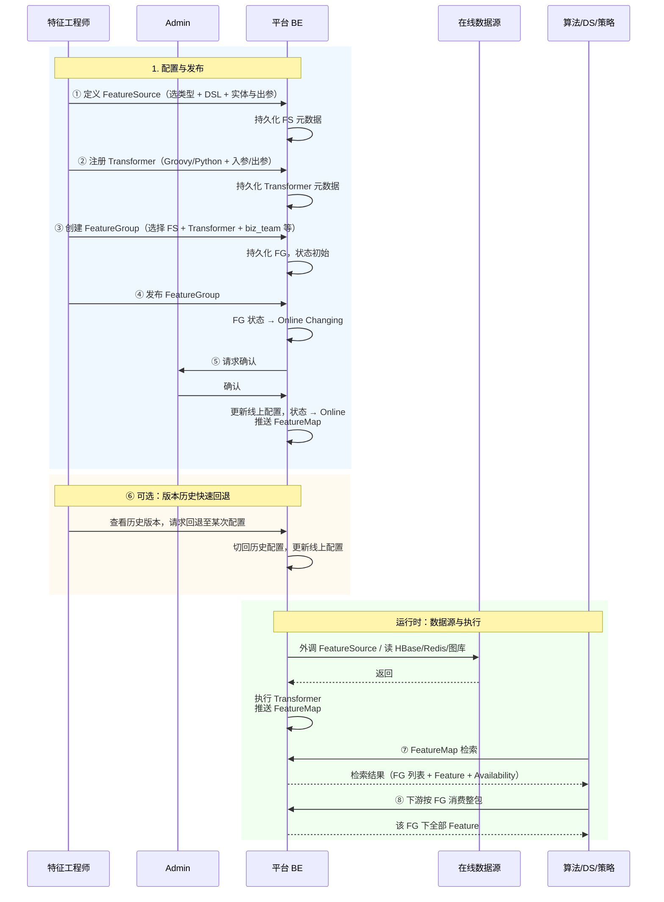

# 在线特征平台 — 产品与交付示意图

Tech PM 视角：产品架构、操作主流程、数据流转，以及交付开发做背景了解与方案预研所需的示意图。

---

## 1. 特征平台产品架构图

从产品能力与用户视角划分模块与边界，便于产品/业务对齐。

```
┌─────────────────────────────────────────────────────────────────────────────────────────┐
│                              在线特征平台 (产品边界)                                       │
├─────────────────────────────────────────────────────────────────────────────────────────┤
│                                                                                         │
│   ┌─────────────────────────────────────────────────────────────────────────────────┐   │
│   │ 面向：算法/特征工程师                                                              │   │
│   ├─────────────────────────────────────────────────────────────────────────────────┤   │
│   │                                                                                 │   │
│   │  ┌──────────────────┐  ┌──────────────────┐  ┌──────────────────┐               │   │
│   │  │ FeatureSource    │  │ Transformer      │  │ FeatureGroup     │               │   │
│   │  │ 管理             │  │ 管理             │  │ 管理             │               │   │
│   │  │                  │  │                  │  │                  │               │   │
│   │  │ · 选择数据源类型  │  │ · 注册 Groovy/   │  │ · 绑定 FS + T    │               │   │
│   │  │ · 编写/配置 DSL   │  │   Python 脚本    │  │ · Offline/Online │               │   │
│   │  │ · 声明实体与出参  │  │ · 入参/出参约定  │  │   FG Config      │               │   │
│   │  │                  │  │                  │  │ · 版本历史 Tab   │               │   │
│   │  │                  │  │                  │  │   + 快速回退     │               │   │
│   │  └────────┬─────────┘  └────────┬─────────┘  └────────┬─────────┘               │   │
│   │           │                     │                     │                          │   │
│   │           └─────────────────────┼─────────────────────┘                          │   │
│   │                                 │ 元数据 + 配置                                     │   │
│   │                                 ▼                                                  │   │
│   │  ┌──────────────────────────────────────────────────────────────────────────┐   │   │
│   │  │ 面向：算法/DS/策略                                                          │   │   │
│   │  │  FeatureMap — 检索与文档                                                    │   │   │
│   │  │  · Training/Serving Availability  · 多条件检索  · Feature Cart → 离线/在线画布  │   │   │
│   │  │  · 按实体、biz_team、可见性检索  · 查看 FG 及包内 Feature  · 仅可见不可用提示  │   │   │
│   │  └──────────────────────────────────────────────────────────────────────────┘   │   │
│   │                                 │ 仅检索，不拉取特征；购物车衔接到 WideTable/Serving 画布 │   │
│   └─────────────────────────────────┼───────────────────────────────────────────────┘   │
│                                     │                                                    │
│   │  ┌──────────────────────────────────────────────────────────────────────────┐   │   │
│   │  │ Feature WideTable（离线宽表画布）· 输入：所选 FG · Key Table + Smart Join  │   │   │
│   │  │ · 输出：离线宽表（Hive）· 与架构说明 §5 离线宽表与 Point-in-Time Join 一致   │   │   │
│   │  └──────────────────────────────────────────────────────────────────────────┘   │   │
│   │                                 │ 详见 §1.2 产品页面结构                          │   │
│   │                                 │                                                    │
│   ┌─────────────────────────────────┼───────────────────────────────────────────────┐   │
│   │ 面向：下游消费方（推荐/风控/特征包直调）                                            │   │
│   │  消费契约：按 FeatureGroup 维度拉取整包内全部 Feature（平台不暴露单 Feature 拉取）   │   │
│   │  Feature Cart 可衔接到 Serving Workflow Canvas 创建页（入口见 FeatureMap）        │   │
│   └─────────────────────────────────┼───────────────────────────────────────────────┘   │
│                                     │                                                    │
│   ┌─────────────────────────────────▼───────────────────────────────────────────────┐   │
│   │ 平台执行层（对用户透明）                                                           │   │
│   │  · FeatureSource 执行（内置函数读 HBase/Redis/图库；BE 执行在线接口外调）          │   │
│   │  · Transformer 执行（Groovy/Python 运行时）                                      │   │
│   │  · 结果组装为 FG 出参，提供给下游                                                  │   │
│   └─────────────────────────────────────────────────────────────────────────────────┘   │
│                                                                                         │
└─────────────────────────────────────────────────────────────────────────────────────────┘
                                        │
                    ┌───────────────────┼───────────────────┐
                    ▼                   ▼                   ▼
             ┌────────────┐      ┌────────────┐      ┌────────────┐
             │ 上游数据   │      │ 平台 BE    │      │ 下游服务   │
             │ 非本产品   │      │ 归属本产品  │      │ 非本产品   │
             │ (HBase/    │      │ (外调执行) │      │ (推荐/风控/ │
             │  Redis/图库│      │            │      │  特征包)   │
             │  已就绪)   │      │            │      │            │
             └────────────┘      └────────────┘      └────────────┘
```

**产品架构要点（Tech PM 可强调）**

| 维度 | 说明 |
|------|------|
| 用户分层 | 算法/特征工程师：配置与发布；算法/DS/策略：检索；下游：按 FG 消费。 |
| 能力边界 | 平台不负责上游数据加工（Spark/Flink）与下游耗时/监控；只负责「取数 → 加工 → 特征包出口」。 |
| 唯一出口 | 下游仅能按 FeatureGroup 消费整包特征，FeatureMap 不做特征拉取。 |
| FG 双配置 | 注册/编辑含 Offline FG Config（Hive/marker/历史）、Online FG Config（在线存储/最新值）；详见 [架构说明 §3.1 / §4.5](../../architecture/在线特征平台架构说明.md)。 |
| 消费层 | Feature WideTable（离线宽表画布）为平台内产品模块；Feature Cart 可衔接到 WideTable 画布或 Serving Workflow Canvas 创建页（入口见 FeatureMap）。 |

---

## 1.2 特征平台产品页面结构（Feature Store）

与 [在线特征平台架构说明](../../architecture/在线特征平台架构说明.md) 四层及特征消费层对应，便于产品/前端与架构对齐。以下为 Feature Store 五大块及配置项摘要。

### 1. Feature Source

> 承载原 UDF 外调 IO 相关职能；职责与架构说明 §4.1 FeatureSource 层一致。

- **配置项**：Region、Script、Input & Output、Connection Check。创建/编辑拆分为**元信息**（Feature Source 名、SourceType、Data Latency、Description）与 **Region 配置**（Feature Source 只读、Region、Input/Output Params、Call Function）两步，与产品原型 §3.1.2 一致。
- **Region**：部署/区域标识（如 region 标识），属于 **Metainfo 范畴**，与 FG Metainfo 的 Region 可关联。

### 2. Transformation

> 承载原 UDF 特征加工相关职能；职责与架构说明 §4.2 Transformer 层一致。

- **配置项**：Region、Script、Input & Output、Code Review、Version、Test & History。
- 版本仅指 **Transformer Version**；运维与追溯与架构 §4.5 对应。

### 3. Feature Group

职责与架构说明 §4.3 FeatureGroup 层、§4.5 配置层一致。**同一时刻仅一个 FG 版本生效**（架构侧「更新即 Force Release」）；产品侧提供 **FG 版本历史** Tab，记录每次发布的配置快照（Metainfo + Offline FG Config + Online FG Config），定义范畴大于 Transformer Version，支持查看历史版本并**快速回退**至某次历史配置（如新版本配置有误、出现线上影响时）。

#### 3.1 注册 / 编辑表单

- **Meta Info**：Module 数据域、Entity 实体、Latency 时效性、Owner。
- **Offline FG Config（marker offset）**：离线特征暂存储（Regional），含历史数据、大数据量，无法直接在线消费。
- **Online FG Config**：在线特征暂存储（Local），仅最新数据、小数据量，可直接在线消费。

#### 3.2 衍生功能 Tab 页

- **Feature List & Availability**：调用统计、数据探索 Summary；含 **Training Availability** 与 **Serving Availability**。
- **上下游血缘**。
- **离线 DQC 结果展示**（DQC 执行与责任归属上游/任务层；平台负责配置与按指定模板如实展示数据结果，不对数据质量负责）。
- **版本历史 + 快速回滚**：FG 版本历史 Tab 记录每次发布的 Metainfo + Offline/Online Config 快照，支持查看历史并回退至某次配置；同一时刻仅一版生效。

### 4. Feature Map

> 特征资产地图，与架构说明 §4.4 一致。

- 全量展示全部特征粒度的 **Training Availability** 与 **Serving Availability**；支持多条件组合检索。
- 支持复选框，勾选中的 Feature 加入左下角 **Feature Cart**；点击购物车可衔接到 **Training Workflow Canvas** 或 **Serving Workflow Canvas** 的创建页。

### 5. Feature WideTable（即离线宽表画布 / 特征宽表生成画布）

与架构说明 §5 离线宽表与 Point-in-Time Join 一致；WideTable 与「离线宽表画布」术语混用。

#### 5.1 注册 / 编辑画布页

1. **Add Frame From Hive**：Smart Join 配置，直接 left join 其他表；表权限校验；指定 PK 列、EventTime 列；默认未指定列作为外列。
2. **选择特征集 Feature Group**：选择各 FG 节点中的 Feature 出参（即参与拼接的 Training Feature）；指定各 FG 的 Offline Hive Config 中作为 EventTime 的 Field Column；指定各 FG 与 Frame Table 的 Smart Join 条件；可选 Where 条件。
3. **WideTable Output**：指定 Spark 任务执行参数与优先级；指定 DQC 模板；选择 Report 模板。DQC 执行与数据质量责任归属上游/任务层；平台负责配置与**按指定模板如实展示数据结果**（如 WideTable 列表页 Action → **View Data Report**、FG 衍生 Tab 的离线 DQC 结果），**不对数据质量负责**。

#### 5.2 列表页

- 字段：Name、Desc、Creator、Status、ResultTable、**Action**（状态变更 Trigger/Kill/Rerun、**Data Report**、**View Task**）。其中 **View Data Report** 按指定 Report 模板如实展示数据结果（平台不对数据质量负责）。

---

## 2. 操作主流程示意图

核心角色在平台内的主要操作顺序与分支。

### 2.1 算法/特征工程师：从配置到上线

下图合并「产品与交付」视角的配置/发布/回退流程与 [架构说明 §7 数据流](../../architecture/在线特征平台架构说明.md) 中的定义与运行时交互，形成端到端时序。



### 2.2 算法/DS/策略：检索可用特征

```
    算法/DS/策略                        平台 FeatureMap
           │                            │
           │ ① 打开 FeatureMap          │
           ├───────────────────────────►│
           │                            │ 按实体 / biz_team / 关键词 检索
           │◄───────────────────────────┤ 返回 FG 列表及包内 Feature
           │                            │ （含 Training/Serving Availability、「仅可见不可用」标识）
           │                            │
           │ ② 选定 FG，查看详情        │
           ├───────────────────────────►│
           │◄───────────────────────────┤ 实体、Feature 列表、DataType、权限说明
           │                            │
           │ ③（可选）勾选 Feature → Feature Cart → 进入 WideTable 画布 或 Serving 画布创建页
           ├───────────────────────────►│
           │                            │ 从购物车衔接到 Feature WideTable（离线宽表）画布
           │                            │ 或 Serving Workflow Canvas 创建页
           │                            │
           │ ④ 与下游对接时：按 FG 维度消费（在推荐/风控等系统中完成，非本平台操作）
           │                            │
```

### 2.3 下游服务：按 FG 消费特征（平台外）

```
    下游服务（推荐/风控/特征包直调）      在线特征平台
           │                            │
           │ 请求：FG_id + 实体 ID 等    │
           ├───────────────────────────►│
           │                            │ 执行 FS 取数 → Transformer 加工
           │◄───────────────────────────┤ 返回该 FG 下全部 Feature
           │                            │
```

**操作主流程小结**

| 角色 | 主流程 | 关键结果 |
|------|--------|----------|
| 算法/特征工程师 | 创建 FS → 注册 T → 创建 FG → 发布 → (可选)FG 版本历史快速回退 | FG Online，FeatureMap 可检索 |
| Admin | 对「Online Changing」的 FG 确认 | 线上配置更新，FeatureMap 同步 |
| 算法/DS/策略 | FeatureMap 检索 → 查看 FG 详情 → (可选)Feature Cart → WideTable/Serving 画布 | 确定可用 FG；可进入离线宽表或在线画布编排 |
| 下游服务 | 按 FG 请求特征（平台外） | 获得整包 Feature |

---

## 3. 数据流转示意图

区分「请求/元数据流」与「特征数据流」。

### 3.1 元数据与配置流（谁写、谁读）

```
  ┌─────────────────────┐
  │ 算法/特征工程师      │
  └──────────┬──────────┘
             │ 创建/编辑
             ▼
  ┌─────────────────────┐    持久化      ┌─────────────────────┐
  │ FeatureSource 定义   │──────────────►│ 平台元数据存储       │
  │ Transformer 定义    │               │ (FS / T / FG 配置)   │
  │ FeatureGroup 定义   │               └──────────┬──────────┘
  └─────────────────────┘                         │
             │                                    │ 发布/Admin 确认后
             │ 发布 FG                             │ 推送/同步
             ▼                                    ▼
  ┌─────────────────────┐               ┌─────────────────────┐
  │ Admin 确认           │               │ FeatureMap          │
  └──────────┬──────────┘               │ (检索与文档)         │
             │ 确认                      └──────────┬──────────┘
             ▼                                      │ 只读检索
  ┌─────────────────────┐               ┌──────────▼──────────┐
  │ 线上 FG 配置（当前   │               │ 算法/DS/策略         │
  │ 生效配置）           │               └─────────────────────┘
  └──────────┬──────────┘

             │ 读配置执行
             ▼
  ┌─────────────────────┐
  │ 平台执行层           │
  │ (FS + Transformer)  │
  └─────────────────────┘
```

### 3.2 特征数据流（一次请求内的数据走向）

```
  下游服务                在线特征平台                    在线数据源
      │                         │                              │
      │ 请求 FG + 实体 ID        │                              │
      ├────────────────────────►│                              │
      │                         │ 1. 根据 FG 加载 FS + T 配置   │
      │                         │ 2. 执行 FeatureSource        │
      │                         ├─────────────────────────────►│
      │                         │    (HBase/Redis/图库/外调)    │
      │                         │◄─────────────────────────────┤
      │                         │    原始/半结构化数据          │
      │                         │ 3. 执行 Transformer          │
      │                         │    输入：FS 出参 → 输出：Feature 列表
      │                         │ 4. 按 FG 契约组装响应         │
      │                         │                              │
      │◄────────────────────────┤ 返回：该 FG 下全部 Feature    │
      │                         │                              │
```

### 3.2.1 离线宽表数据流（Feature WideTable）

与 [架构说明 §5.2](../../architecture/在线特征平台架构说明.md) 离线宽表流程一致：FG Selection（来自 Feature Cart/画布所选）→ Offline FG Config → Key Table（Spine）→ Smart Join（point-in-time correct）→ **Data Ingestion**。画布侧回显 Hive **Raw 宽表名**（只读）；**Data Cleaning** 节点上若开启清洗，则按平台规则落 **Cleaned** 表（详见《产品原型图》§3.5.2 与 [`widetable-canvas-nodes-revamp.md`](../widetable-canvas-nodes-revamp.md)）。

```
  画布配置/用户              平台（WideTable 任务）              Hive / 数据源
      │                            │                                    │
      │ Key Table(Spine) + 所选 FG  │                                    │
      │ EventTime、Smart Join 条件  │                                    │
      ├───────────────────────────►│                                    │
      │                            │ 1. 读取 Key Table（左表）            │
      │                            │ 2. 按 FG Offline Config 读各 FG 离线表
      │                            ├────────────────────────────────────►│
      │                            │◄────────────────────────────────────┤
      │                            │ 3. Point-in-Time Smart Join         │
      │                            │ 4. （可选）DQC/Report 配置由任务层执行
      │                            │ 5. 写出 Result Table                │
      │                            ├────────────────────────────────────►│
      │◄───────────────────────────┤ 状态 / ResultTable 地址             │
```

### 3.3 数据流汇总（一图看清两类流）

```
  ┌──────────────┐                    ┌──────────────────────────────────────┐
  │ 配置/元数据   │                    │ 特征数据（运行时）                     │
  │ 流           │                    │ 流                                    │
  ├──────────────┤                    ├──────────────────────────────────────┤
  │ 人 → FS/T/FG │                    │ 在线：下游请求 → FS → 数据源 → T → 返回  │
  │ → 元数据存储 │                    │ 离线：Key Table + FG → Smart Join → 宽表  │
  │ → 发布确认   │                    │ 数据源：HBase / Redis / 图库 / 在线接口 / Hive │
  │ → FeatureMap │                    │ 平台不落库在线特征结果，按请求实时计算   │
  │ (只读检索)   │                    │                                        │
  └──────────────┘                    └──────────────────────────────────────┘
```

---

## 4. 技术 PM 交付开发的必要示意图

供开发做**背景理解**与**方案/预研**用：系统边界、模块职责、接口与契约、预研点。

### 4.1 系统边界与模块职责（开发视角）

```
┌─────────────────────────────────────────────────────────────────────────────────┐
│ 本系统（在线特征平台）边界                                                         │
├─────────────────────────────────────────────────────────────────────────────────┤
│                                                                                 │
│  ┌─────────────┐  ┌─────────────┐  ┌─────────────┐  ┌─────────────┐  ┌─────────────────┐ │
│  │ FS 管理服务  │  │ T 管理服务   │  │ FG 管理服务  │  │ FeatureMap  │  │ WideTable 服务  │ │
│  │             │  │             │  │             │  │ 服务         │  │ /画布             │ │
│  │ · FS CRUD   │  │ T 注册/版本 │  │ FG CRUD     │  │ · 检索 API  │  │ · 列表/画布配置   │ │
│  │ · 类型枚举   │  │ · 脚本存储  │  │ · 发布/状态  │  │ · 可见性    │  │ · Smart Join /   │ │
│  │ · DSL 校验  │  │ · 入出参约定 │  │ · 版本历史   │  │ · 从 FG 同步│  │   EventTime      │ │
│  │             │  │             │  │   +快速回退  │  │ · Feature   │  │ · 输出与任务触发  │ │
│  └──────┬──────┘  └──────┬──────┘  └──────┬──────┘  │   Cart      │  └────────┬────────┘ │
│         │                 │                 │       └──────┬──────┘            │          │
│         └─────────────────┼─────────────────┼──────────────┼────────────────────┘          │
│                           │                 │                                    │
│                           ▼                 ▼                                    │
│  ┌────────────────────────────────────────────────────────────────────────────┐ │
│  │ 运行时 / 执行层（预研重点）                                                  │ │
│  │ · FS 执行引擎：按数据源类型调度（HBase/Redis/图库 内置函数；在线接口 → BE）   │ │
│  │ · Transformer 执行引擎：Groovy/Python 沙箱，入参=FS 出参，出参=Feature 列表  │ │
│  │ · FG 编排：一次请求内 执行 FS → 执行 T → 组装响应                            │ │
│  └────────────────────────────────────────────────────────────────────────────┘ │
│                           │                                                      │
└───────────────────────────┼──────────────────────────────────────────────────────┘
                            │
        ┌───────────────────┼───────────────────┬───────────────────┐
        ▼                   ▼                   ▼                   ▼
  ┌──────────┐       ┌──────────┐       ┌──────────┐       ┌──────────┐
  │ HBase    │       │ Redis    │       │ 图数据库  │       │ 外部接口  │
  │ 客户端   │       │ 客户端   │       │ 客户端   │       │ (BE 调用) │
  └──────────┘       └──────────┘       └──────────┘       └──────────┘
```

### 4.2 关键接口/契约（开发需实现或遵守）

```
┌─────────────────────────────────────────────────────────────────────────────────┐
│ 接口/契约摘要                                                                    │
├─────────────────────────────────────────────────────────────────────────────────┤
│                                                                                 │
│ 1. FeatureSource → 执行层                                                        │
│    输入：FS 配置（类型、DSL/参数、实体与出参描述）、请求上下文（如实体 ID）         │
│    输出：约定结构的原始/半结构化数据（供 Transformer 消费）                        │
│    预研：各数据源类型下内置函数 API、超时与限流、外调由 BE 统一出口                │
│                                                                                 │
│ 2. Transformer → 执行层                                                         │
│    输入：平台约定的统一结构（即 FS 出参封装）                                     │
│    输出：多 Feature（名称 + 值 + DataType）                                      │
│    预研：Groovy/Python 运行时、沙箱与资源限制、入参/出参 schema 校验（可选）      │
│                                                                                 │
│ 3. FeatureGroup → 下游                                                           │
│    请求：FG 标识 + 实体 ID（及 FS 所需其它入参）                                  │
│    响应：该 FG 下全部 Feature（名称 + 值 + DataType）                             │
│    预研：并发、超时、降级策略（归属下游，但平台需明确契约便于下游设计）            │
│                                                                                 │
│ 4. FeatureMap                                                                   │
│    输入：检索条件（实体、biz_team、关键词等）                                      │
│    输出：FG 列表 + 包内 Feature 列表 + Training/Serving Availability + 可见性    │
│    预研：与 FG 发布流程的同步方式（推送 vs 轮询）、权限过滤实现                    │
│                                                                                 │
│ 5. Feature WideTable（离线宽表画布）→ 任务层 / 输出                             │
│    输入：Key Table(Spine)、所选 FG、各 FG Offline Config、EventTime 列、         │
│          Smart Join 条件、Where（可选）                                          │
│    输出：Result Table（Hive 等）、任务状态；可选 DQC/Report 由任务层执行          │
│    预研：Point-in-Time Smart Join 与 EventTime 实现、与 FG Offline Config 契约   │
│                                                                                 │
└─────────────────────────────────────────────────────────────────────────────────┘
```

### 4.3 预研与风险点清单（Tech PM 交付开发）

| 序号 | 预研/风险点 | 说明 | 建议方向 |
|------|-------------|------|----------|
| P1 | FS 执行引擎与数据源接入 | 四类数据源（HBase/Redis/图库/在线接口）的客户端、内置函数形态、BE 外调统一出口 | 先做 HBase/Redis 与一种外调形态，再扩展图库 |
| P2 | Transformer 运行时 | Groovy/Python 沙箱、依赖注入（FS 出参）、超时与内存限制 | 评估现有 UDF 运行时是否复用，或引入轻量脚本引擎 |
| P3 | FG 发布与 FeatureMap 同步 | 从「Online Changing」到 Admin 确认的持久化与推送；FeatureMap 最终一致性 | 事件推送 vs 定时同步，选型与幂等 |
| P4 | 多实体与权限 | 多实体 FG、biz_team 可见/可用规则在检索与执行时的过滤 | 与权限中心或 IDP 的集成方式 |
| P5 | FG 版本历史与快速回退 | 存储每次发布的配置快照（Metainfo + Offline/Online Config）；同一时刻仅一版生效；回退即切换当前生效配置 | 版本历史 Tab 与「当前版本」指针；与架构「Force Release」一致 |
| P6 | 离线宽表 Smart Join 与 EventTime | WideTable 画布中 Key Table + 多 FG、point-in-time correct join、EventTime 列 | 与架构说明 §5.1–5.2 一致；预研 Spark/引擎侧实现 |

---

## 5. 文档索引（与架构说明的关系）

| 文档 | 用途 |
|------|------|
| [在线特征平台架构说明.md](../../architecture/在线特征平台架构说明.md) | 四层概念、边界、术语统一 |
| 本文档（产品与交付示意图.md） | 产品架构、操作流程、数据流转、交付开发的示意图与预研清单 |

**术语与边界（与架构对齐）**：**Feature WideTable** = 离线宽表画布（特征宽表生成画布）。**FG 版本历史**：产品侧 Tab 记录每次发布的 Metainfo + Offline/Online Config 快照，同一时刻仅一版生效（与架构「Force Release」一致），支持查看历史并快速回退；**Transformer Version** 为 T 层独立版本。**DQC/Report**：WideTable 支持配置 DQC/Report 模板；DQC 执行与数据质量责任归属上游/任务层；平台负责配置与**按指定模板如实展示数据结果**（如 Action → View Data Report），**不对数据质量负责**。

建议：先读《在线特征平台架构说明》建立概念，再使用本文档做产品宣讲或开发交接。
